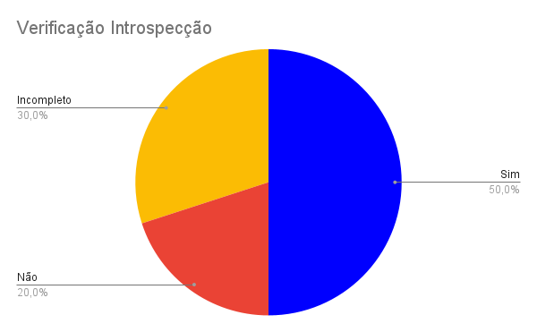

# Introspeção

## Introdução
Segundo a norma internacional ISO/IEC/IEEE 12207:2017(E) (ISO/IEC/IEEE, 2017, p. 82) [1], o objetivo da verificação se define em "prover evidência objetiva que o sistema ou elemento do sistema atende completamente seus requisitos e características especificados". Com isso, afim de garantir qualidade e consistência dos requisitos, realizaremos a verificação dos documentos do nosso grupo, [Caesb](https://requisitos-de-software.github.io/2023.1-Caesb/)[2], da disciplina Requisitos de Software.

## Objetivo
O objetivo deste documento é realizar a verificação da introspeção artefato da Entrega 2, do Grupo 4 (CAESB). De forma impessoal, este documento não deseja avaliar os membros do grupo, mas o artefato em si.

## Metodologia
Como método de investigação e produção da verificação, utilizaremos a inspeção, mais especificamente a _Fagan Inspection_. Na qual, segundo Bush [3], consiste na "inspeção de documentos entendidos como prontos para uso e busca por defeitos". Seguindo as etapas de planejamento, visão geral, preparação, inspeção e correção. Maiores detalhes de planejamento, estão apresentados no [Planejamento da Entrega 2](../0planejamento.md).

## Verificações Anteriores
Uma das atividades da disciplina de Requisitos de Software, ministrada pelo professor André Barros, foi a realização da verificação de um projeto de outro grupo. Desse modo a nossa verificação foi feita sobre a Introspeção do Grupo 05 (Simplenote) e o grupo 03 (VLC Media Player), fez a inspeção do nosso projeto (OpenStreeMap). 

Dessa forma, reavaliamos nosso checklist, levando em conta os pontos levantados pelo grupo 3, mas principalmente baseando-se nas literaturas de referência. Assim, um novo checklist foi criado para a avaliação da nossa introspeção.

## Checklist
Os checklists foram estabelecidos com base nos critérios estabelecidos nos slides da professora Milene [4]. Seguindo as perguntas padrões estabelecidas pelo grupo no [Planejamento Geral](../0planejamento-geral.md), está apresentado na Tabela 1, o checklist da introspecção.

|  ID | Descrição | Avaliação | Observação | 
|:---:|-----------|:---------:|------------|
| 1 | O artefato possui uma introdução condizente com o conteúdo do texto? | Sim || 
| 2 | Todas as bibliografias/referências bibliográficas são utilizadas de forma correta? | Incompleto | Não existe bibliografia de onde se foi baseado o método. | 
| 3 | Todas as tabelas e figuras são chamadas no texto, possuem legendas e fontes? | Sim || 
| 4 | A metodologia esta de acordo com o artefato analisado? | Incompleto | Foi seguido uma metodologia, mas não existe uma seção que fale sobre ela. |
| 5 | É apresentado o cronograma de preparação para realizar a elicitação?<a href="#1">¹</a> | Não ||
| 6 | Existe a rastreabilidade do artefato?<a href="#2">²</a> | Não ||
| 7 | Os requisitos estão identificados por ID?| Sim ||
| 8 | A pessoa que elicitou os requisitos, colocou suas preferências pessoais no processo de elicitação?<a href="#3">³</a> | Incompleto | É dito que foi feito assim, mas não há provas disso. |
| 9 | Os requisitos elicitados foram identificados corretamente?<a href="#4">⁴</a> | Sim ||
| 10 | Foram elicitados requisitos que o aplicativo não possui? | Sim ||

Tabela 1 - Checklist da Introspecção (Fonte: Autor)

¹ - Um cronograma que mostre todas as etapas de preparação até o momento que ocorreu a elicitação, trazendo pontos como quando foi feito o estudo do aplicativo.

² - Gravação da Elicitação.

³ - Essa técnica consiste em que a pessoa que está fazendo, imaginar o que ela gostaria, caso precisasse desempenhar uma determinada tarefa com os equipamentos e recursos disponíveis.

⁴ - Entre Requisitos Funcionais (Que representam funcionalidades do Sistema) e não Funcionais(Representam uma característica, qualidade ou restrição do Sistema).

## Gráfico
Com base no checklist feito no processo de inspeção da introspeção, foi produzido o gráfico de avaliação do artefato, que pode ser visualizado/analisado na Figura 1.

Figura 1 - Gráfico de Introspecção. (Fonte: Autor)

## Correção
O planejamento e a situação da correção dos artefatos da introspecção será registrado na Tabela 2.

| ID | Descrição | Detalhes | Corretor | Revisor | Data | Status |
|:--:|:---------:|----------|:--------:|:-------:|:----:|:------:|
| 2 | Bibliografia | Adicionar a bibliografia que mostra o método usado | [Daniel](https://github.com/daniel-de-sousa) | [Raquel](https://github.com/raqueleucaria) | 21/06/2023 a 23/06/2023 | OK |
| 4 | Metodologia |  Adicionar uma parte específica da metodologia | [Daniel](https://github.com/daniel-de-sousa) | [Raquel](https://github.com/raqueleucaria) | 21/06/2023 a 23/06/2023 | OK |
| 5 | Cronograma | Adicionar um cronograma de toda a etapa de elicitação | [Daniel](https://github.com/daniel-de-sousa) | [Raquel](https://github.com/raqueleucaria) | 26/06/2023 a 30/06/2023  | - |
| 6 | Sem gravação | Fazer a gravação da elicitação (Não necessariamente elicitando outros requisitos) | [Daniel](https://github.com/daniel-de-sousa) | [Raquel](https://github.com/raqueleucaria) | 26/06/2023 a 30/06/2023  | - |
| 8 | Preferências na elicitação | Ao adicionar a gravação essa parte será satisfeita | [Daniel](https://github.com/daniel-de-sousa) | [Raquel](https://github.com/raqueleucaria) | 26/06/2023 a 30/06/2023 | - |

Tabela 2 - Distribuição da Correção dos Artefatos (Fonte: Autores)

## Atualização
Depois da atualização, se realizou uma nova verificação, apresentando as seguintes porcentagens:

* 21/06/2023 - Adição da bibliografia (ID 2) - Projeto 60% correto.
* 21/06/2023 - Adição da seção de Metodologia (ID 4) - Projeto 70% correto.

## Referência bibliográfica

> [1] ISO/IEC/IEEE 12207:2017(E) (ISO/IEC/IEEE, 2017, p. 82). Disponível em: <https://www.iso.org/obp/ui/#iso:std:iso-iec-ieee:24765:ed-2:v1:en> . Acesso em: 13 jun. 2023

> [2] CAESB, grupo 4. Disponível em <https://requisitos-de-software.github.io/2023.1-Caesb/> . Acesso em: 16 jun. 2023.

> [3] BUSH, Marilyn, Chris Gerrard, Clifford Shelley. Fagan Inspection: The Silver Bullet No-one Wants to Fire. London SPIN, 25 mar. 2010.

> [4] SERRANO, Milene, SERRANO, Maurício. Requisitos (Aula 07): Elicitação, Modelagem e Análise. UnB Gama, Brasília, 2023. Disponível no [link](../../assets/referencias/RequisitosAula7-elicitacao.pdf)

## Bibliografia

> SERRANO, Milene, SERRANO, Maurício.  Análise de Requisitos (Aula 07). UnB Gama, Brasília, 2023. Acesso em: 21 jun. 2023.

> PENHA, Igor, Lucas Gobbi. Verificação da Introspecção (Caesb). Repositório do Grupo VLC da disciplina de Requisitos da Universidade de Brasília, 2023. Disponível em: <https://github.com/Requisitos-de-Software/2023.1-VLC/blob/master/docs/verificacao/entrega_2/introspeccao.md/>. Acesso em: 21 de Junho de 2023.

> SANTOS, Daniel. Introspecção.  Repositório do Grupo CAESB da disciplina de Requisitos da Universidade de Brasília, 2023. Disponível em: <https://requisitos-de-software.github.io/2023.1-Caesb/Verificacao/Grupo5/Entrega2/elicitacao/introspeccao/>. Acesso em: 21 de Junho de 2023.

> VAZQUEZ, Carlos E; SIMÔES, Guilherme S. Engenharia de Requisitos Software Orientado ao Negócio. Acesso em: 21 de Junho de 2023.

> REINEHR, Sheila. Engenharia de requisitos. E-book. ISBN 9786556900674. Disponível em: <https://integrada.minhabiblioteca.com.br/#/books/9786556900674/>. Acesso em: 13 jun. 2023.

> Sommerville, Ian. Engenharia de software. 08. ed. São Paulo: Pearson Addison Wesley, 2007.

## Histórico de Versão
|    Data    | Data Prevista de Revisão | Versão |      Descrição       |                    Autor                     |                   Revisor                  |
| :--------: | :----------------------: | :----: | :------------------: | :------------------------------------------: | :----------------------------------------: |
| 21/06/2023 |        21/06/2023        |  1.0   | Criação do documento | [Daniel](https://github.com/daniel-de-sousa) | [Raquel](https://github.com/raqueleucaria) |