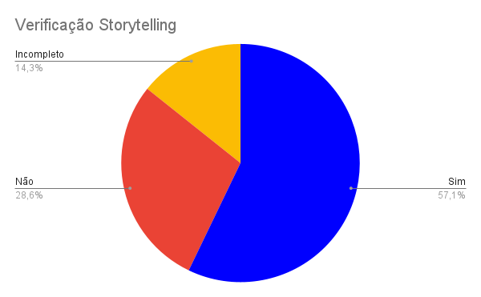

# Storytelling

## Introdução

Segundo a norma internacional ISO/IEC/IEEE 12207:2017(E) (ISO/IEC/IEEE, 2017, p. 82) [1], o objetivo da verificação se define em "prover evidência objetiva que o sistema ou elemento do sistema atende completamente seus requisitos e características especificados". Com isso, afim de garantir qualidade e consistência dos requisitos, realizaremos a verificação dos documentos do nosso grupo, [Caesb](https://requisitos-de-software.github.io/2023.1-Caesb/)[2], da disciplina Requisitos de Software.

## Objetivo

O objetivo deste documento é realizar a verificação do storytelling, artefato da Entrega 2, do Grupo 4 (CAESB). De forma impessoal, este documento não deseja avaliar os membros do grupo, mas o artefato em si.

## Metodologia

Como método de investigação e produção da verificação, utilizaremos a inspeção, mais especificamente a _Fagan Inspection_. Na qual, segundo Bush [3], consiste na "inspeção de documentos entendidos como prontos para uso e busca por defeitos". Seguindo as etapas de planejamento, visão geral, preparação, inspeção e correção. Maiores detalhes de planejamento, estão apresentados no [Planejamento da Entrega 2](../0planejamento.md).

## Verificações Anteriores

Uma das atividades da disciplina de Requisitos de Software, ministrada pelo professor André Barros, foi a realização da verificação de um projeto de outro grupo. Desse modo a nossa verificação foi feita sobre o storytelling do Grupo 05 (Simplenote) e o grupo 03 (VLC Media Player), fez a inspeção do nosso projeto (OpenStreeMap).

Dessa forma, reavaliamos nosso checklist, levando em conta os pontos levantados pelo grupo 3, mas principalmente baseando-se nas literaturas de referência. Assim, um novo checklist foi criado para a avaliação do nosso storytelling.

## Checklist

Os checklists foram estabelecidos com base nos critérios estabelecidos nos slides da professora Milene [4]. Seguindo as perguntas padrões estabelecidas pelo grupo no [Planejamento Geral](../0planejamento-geral.md), está apresentado na Tabela 1, o checklist do storytelling.

| ID | Descrição                                                                                                                       | Avaliação | Observação                                |
| :-: | --------------------------------------------------------------------------------------------------------------------------------- | :---------: | ------------------------------------------- |
| 1 | O artefato possui uma introdução condizente com o conteúdo do texto?                                                           |     Sim     |                                             |
| 2 | Todas as bibliografias/referências bibliográficas são utilizadas de forma correta?                                             | Incompleto | Falta colocar no padrão.                   |
| 3 | Todas as tabelas e figuras são chamadas no texto, possuem legendas e fontes, levando em conta suas características?             |     Sim     |                                             |
| 4 | A metodologia esta de acordo com o artefato analisado?                                                                            |     Sim     | Pode se acrescentar detalhes                |
| 5 | As histórias possuem participação de StakeHolders ou Personas?`<a href="#1">`¹`</a>`                                      |     Sim     |                                             |
| 6 | O storytelling apresenta uma utilização típica do aplicativo marcada por uma sequência de eventos?`<a href="#2">`²`</a>` |    Não    |                                             |
| 7 | Foram elicitados requisitos a partir das histórias?`<a href="#3">`³`</a>`                                                   |     Sim     |                                             |
| 8 | Os requisitos foram classificados corretamente?`<a href="#3">`³`</a>`                                                        |     Sim     |                                             |
| 9 | Foram elicitados requisitos não presentes no aplicativo?                                                                         |    Não    | Não há identificação.                   |
| 10 | Todos os requisitos são verificáveis?                                                                                           | Incompleto | Alguns são difíceis de serem verificados. |
| 11 | As histórias foram criadas no formato narrativo?`<a href="#4">`⁴`</a>`                                                      |     Sim     |                                             |
| 12 | Como as histórias foram elaboradas é de forma cotidiana?`<a href="#5">`⁵`</a>`                                             |     Sim     |                                             |
| 13 | Existe a rastreabilidade?`<a href="#6">`⁶`</a>`                                                                              |    Não    |                                             |

Tabela 1 - Checklist do storytelling (Fonte: Autor)

¹ - Se existia mais alguém presente para poder corrigir e ajudar na elaboração.

² - Uma das tarefas normalmente usadas dentro do aplicativo.

³ - Entre Requisitos Funcionais (Que representam funcionalidades do Sistema) e não Funcionais(Representam uma característica, qualidade ou restrição do Sistema).

⁴ - Formato narrativo é aquele que conta uma história.

⁵ - Não apresentam termos técnicos ou jargões.

⁶ - Gravação do processo.

## Gráfico

Com base no checklist feito no processo de inspeção do storytelling, foi produzido o gráfico de avaliação do artefato, que pode ser visualizado/analisado na Figura 1.

Figura 1 - Gráfico do storytelling. (Fonte: Autor)

## Correção

O planejamento e a situação da correção do artefato do storytelling será registrado na Tabela 2.

| ID |  Descrição  | Detalhes                                          |                 Corretor                 |                 Revisor                 |          Data          | Status |
| :-: | :-----------: | ------------------------------------------------- | :---------------------------------------: | :-------------------------------------: | :---------------------: | :----: |
| 2 | Bibliografia | Colocar no Padrão                                | [Daniel](https://github.com/daniel-de-sousa) | [Raquel](https://github.com/raqueleucaria) | 21/06/2023 a 23/06/2023 |   OK   |
| 9 | Elicitação | Adicionar coluna de requisitos não implementados | [Daniel](https://github.com/daniel-de-sousa) | [Raquel](https://github.com/raqueleucaria) |       05/07/2023       |   OK   |
| 10 | Verificação | Repensar alguns requisitos                        | [Daniel](https://github.com/daniel-de-sousa) | [Raquel](https://github.com/raqueleucaria) | - | - |

Tabela 2 - Distribuição da Correção dos Artefatos (Fonte: Autores)

## Atualização

Depois da atualização, se realizou uma nova verificação, apresentando as seguintes porcentagens:

* 21/06/2023 - Padronização da Bibliografia (ID 2) - Projeto 64% correto.
* 05/07/2023 - Nova Coluna na Tabela (ID 9) - Projeto 84% correto.

## Referência bibliográfica

> [1] ISO/IEC/IEEE 12207:2017(E) (ISO/IEC/IEEE, 2017, p. 82). Disponível em: [https://www.iso.org/obp/ui/#iso:std:iso-iec-ieee:24765:ed-2:v1:en](https://www.iso.org/obp/ui/#iso:std:iso-iec-ieee:24765:ed-2:v1:en) . Acesso em: 13 jun. 2023

> [2] CAESB, grupo 4. Disponível em [https://requisitos-de-software.github.io/2023.1-Caesb/](https://requisitos-de-software.github.io/2023.1-Caesb/) . Acesso em: 16 jun. 2023.

> [3] BUSH, Marilyn, Chris Gerrard, Clifford Shelley. Fagan Inspection: The Silver Bullet No-one Wants to Fire. London SPIN, 25 mar. 2010.

> [4] SERRANO, Milene, SERRANO, Maurício. Requisitos (Aula 07): Elicitação, Modelagem e Análise. UnB Gama, Brasília, 2023. Disponível no [link](../../assets/referencias/RequisitosAula7-elicitacao.pdf)

## Bibliografia

> SERRANO, Milene, SERRANO, Maurício.  Análise de Requisitos (Aula 07). UnB Gama, Brasília, 2023. Acesso em: 21 jun. 2023.

> PENHA, Igor, Lucas Gobbi. Verificação da Introspecção (Caesb). Repositório do Grupo VLC da disciplina de Requisitos da Universidade de Brasília, 2023. Disponível em: [https://github.com/Requisitos-de-Software/2023.1-VLC/blob/master/docs/verificacao/entrega_2/introspeccao.md/](https://github.com/Requisitos-de-Software/2023.1-VLC/blob/master/docs/verificacao/entrega_2/introspeccao.md/). Acesso em: 21 de Junho de 2023.

> SANTOS, Daniel. Introspecção.  Repositório do Grupo CAESB da disciplina de Requisitos da Universidade de Brasília, 2023. Disponível em: [https://requisitos-de-software.github.io/2023.1-Caesb/Verificacao/Grupo5/Entrega2/elicitacao/introspeccao/](https://requisitos-de-software.github.io/2023.1-Caesb/Verificacao/Grupo5/Entrega2/elicitacao/introspeccao/). Acesso em: 21 de Junho de 2023.

> VAZQUEZ, Carlos E; SIMÔES, Guilherme S. Engenharia de Requisitos Software Orientado ao Negócio. Acesso em: 21 de Junho de 2023.

> REINEHR, Sheila. Engenharia de requisitos. E-book. ISBN 9786556900674. Disponível em: [https://integrada.minhabiblioteca.com.br/#/books/9786556900674/](https://integrada.minhabiblioteca.com.br/#/books/9786556900674/). Acesso em: 13 jun. 2023.

> Sommerville, Ian. Engenharia de software. 08. ed. São Paulo: Pearson Addison Wesley, 2007.

> Tamara M. Mendes1, Carlos A. M. Pietrobon; Uso de Storytelling para Apoiar a Gestão de Conhecimento no Desenvolvimento de Software. Acesso em: 21 junho de 2023.

## Histórico de Versão

|    Data    | Data Prevista de Revisão | Versão |      Descrição      |                   Autor                   |                 Revisor                 |
| :--------: | :-----------------------: | :-----: | :--------------------: | :---------------------------------------: | :-------------------------------------: |
| 21/06/2023 |        21/06/2023        |   1.0   | Criação do documento | [Daniel](https://github.com/daniel-de-sousa) | [Raquel](https://github.com/raqueleucaria) |
| 05/07/2023 |        05/07/2023        |   1.1   | Execução da Correção | [Daniel](https://github.com/daniel-de-sousa) | [Raquel](https://github.com/raqueleucaria) |
