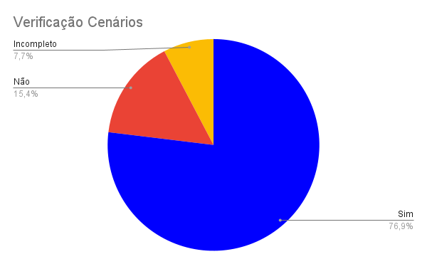

# Cenários

## Introdução
Segundo a norma internacional ISO/IEC/IEEE 12207:2017(E) (ISO/IEC/IEEE, 2017, p. 82) [1], o objetivo da verificação se define em "prover evidência objetiva que o sistema ou elemento do sistema atende completamente seus requisitos e características especificados". Com isso, afim de garantir qualidade e consistência dos requisitos, realizaremos a verificação dos documentos do nosso grupo, [Caesb](https://requisitos-de-software.github.io/2023.1-Caesb/)[2], da disciplina Requisitos de Software.

## Objetivo
O objetivo deste documento é realizar a verificação dos cenários, artefato da Entrega 2, do Grupo 4 (CAESB). De forma impessoal, este documento não deseja avaliar os membros do grupo, mas o artefato em si.

## Metodologia
Como método de investigação e produção da verificação, utilizaremos a inspeção, mais especificamente a _Fagan Inspection_. Na qual, segundo Bush [3], consiste na "inspeção de documentos entendidos como prontos para uso e busca por defeitos". Seguindo as etapas de planejamento, visão geral, preparação, inspeção e correção. Maiores detalhes de planejamento, estão apresentados no [Planejamento da Entrega 2](../0planejamento.md).

## Verificações Anteriores
Uma das atividades da disciplina de Requisitos de Software, ministrada pelo professor André Barros, foi a realização da verificação de um projeto de outro grupo. Desse modo a nossa verificação foi feita sobre s cenários do Grupo 05 (Simplenote) e o grupo 03 (VLC Media Player), fez a inspeção do nosso projeto (OpenStreeMap). 

Dessa forma, reavaliamos nosso checklist, levando em conta os pontos levantados pelo grupo 3, mas principalmente baseando-se nas literaturas de referência. Assim, um novo checklist foi criado para a avaliação dos nossos cenários.

## Checklist
Os checklists foram estabelecidos com base nos critérios estabelecidos nos slides da professora Milene [4]. Seguindo as perguntas padrões estabelecidas pelo grupo no [Planejamento Geral](../0planejamento-geral.md), está apresentado na Tabela 1, o checklist dos cenários.

|  ID | Descrição | Avaliação | Observação | 
|:---:|-----------|:---------:|------------|
| 1 | O artefato possui uma introdução condizente com o conteúdo do texto? | Sim || 
| 2 | Todas as bibliografias/referências bibliográficas são utilizadas de forma correta? | Incompleto | Falta colocar no padrão. | 
| 3 | Todas as tabelas e figuras são chamadas no texto, possuem legendas e fontes, levando em conta suas características? | Sim || 
| 4 | A metodologia esta de acordo com o artefato analisado? | Não | Não existe metodologia |
| 5 | Os cenários possuem seu objetivo explicado?<a href="#1">¹</a> | Sim ||
| 6 | Os cenários possuem os elementos característicos de um cenário, todos de maneira correta?<a href="#1">¹</a> | Sim ||
| 7 | Os cenários são claros, possibilitando entender todo o contexto e o objetivo a ser alcançado? | Sim ||
| 8 | Existe uma variedade de situações nos cenários?<a href="#2">²</a> | Sim ||
| 9 | Os cenários demostram as principais funcionalidades do aplicativo?<a href="#3">³</a> | Sim ||
| 10 | Os cenários estão de acordo com outros artefatos do projeto? | Sim ||
| 11 | Os cenários apresentam quais são as suas pré-condições e restrições? | Não ||
| 12 | Há uma identificação dos recursos envolvidos na sua execução?<a href="#4">⁴</a> | Não ||
| 13 | Os cenários estão associados aos requisitos elicitados?<a href="#5">⁵</a> | Sim ||

Tabela 1 - Checklist dos cenários (Fonte: Autor)

² - São eles os elementos dos cenários tirados do livro interação humano computador[5]:
    
    * Contexto: Detalhes da situação.
    * Atores: Pessoas que interagem no cenário.
    * Objetivos: O que motiva as ações dos atores.
    * Planejamento: Atividade mental dos atores transformadas em um conjunto de ações.
    * Ações: Comportamento observável.
    * Eventos: Ações externas ou reações produzidas pelo computador, ou ambiente.
    * Avaliação: Atividade mental dirigida para interpretar a situação.

³ - As principais tarefas executadas por usuários.

⁴ - Quais os recursos necessários para se executar esse cenário.

⁵ - Eles foram contextualizados usando os requisitos.

## Gráfico
Com base no checklist feito no processo de inspeção dos cenários, foi produzido o gráfico de avaliação do artefato, que pode ser visualizado/analisado na Figura 1.

Figura 1 - Gráfico dos cenários. (Fonte: Autor)

## Correção
O planejamento e a situação da correção do artefato dos cenários será registrado na Tabela 2.

| ID | Descrição | Detalhes | Corretor | Revisor | Data | Status |
|:--:|:---------:|:--------:|:--------:|:-------:|:----:|:------:|
| 2 | Bibliografia | Colocar no Padrão | [Daniel](https://github.com/daniel-de-sousa) | [Raquel](https://github.com/raqueleucaria) | 21/06/2023 a 23/06/2023 | OK |
| 4 | Metodologia | Adicionar a seção de metodologia | [Daniel](https://github.com/daniel-de-sousa) | [Raquel](https://github.com/raqueleucaria) | 21/06/2023 a 23/06/2023 | OK |
| 11 | Condições | Adicionar as condições e exceções para a execução | [Daniel](https://github.com/daniel-de-sousa) | [Raquel](https://github.com/raqueleucaria) | 26/06/2023 a 30/06/2023  | - |
| 12 | Recursos | Deixar claro quais são os recursos usados em cada cenário. | [Daniel](https://github.com/daniel-de-sousa) | [Raquel](https://github.com/raqueleucaria) | 26/06/2023 a 30/06/2023  | - |

Tabela 2 - Distribuição da Correção dos Artefatos (Fonte: Autores)

## Atualização
Depois da atualização, se realizou uma nova verificação, apresentando as seguintes porcentagens:

* 21/06/2023 - Padronização da Bibliografia (ID 2) - Projeto 84% correto.
* 21/06/2023 - Adição da Metodologia (ID 4) - Projeto 92% correto.

## Referência bibliográfica

> [1] ISO/IEC/IEEE 12207:2017(E) (ISO/IEC/IEEE, 2017, p. 82). Disponível em: <https://www.iso.org/obp/ui/#iso:std:iso-iec-ieee:24765:ed-2:v1:en> . Acesso em: 13 jun. 2023

> [2] CAESB, grupo 4. Disponível em <https://requisitos-de-software.github.io/2023.1-Caesb/> . Acesso em: 16 jun. 2023.

> [3] BUSH, Marilyn, Chris Gerrard, Clifford Shelley. Fagan Inspection: The Silver Bullet No-one Wants to Fire. London SPIN, 25 mar. 2010.

> [4] SERRANO, Milene, SERRANO, Maurício. Requisitos (Aula 10): Elicitação, Modelagem e Análise. UnB Gama, Brasília, 2023.

> [5] Barbosa, S. D. J.; Silva, B. S. da; Silveira, M. S.; Gasparini, I.; Darin, T.; Barbosa, G. D. J. (2021) Interação Humano-Computador e Experiência do usuário. Autopublicação. ISBN: 978-65-00-19677-1 . Acesso em 21 de jun.2023

## Bibliografia

> SERRANO, Milene, SERRANO, Maurício.  Análise de Requisitos (Aula 07). UnB Gama, Brasília, 2023. Acesso em: 21 jun. 2023.

> PENHA, Igor, Lucas Gobbi. Verificação da Introspecção (Caesb). Repositório do Grupo VLC da disciplina de Requisitos da Universidade de Brasília, 2023. Disponível em: <https://github.com/Requisitos-de-Software/2023.1-VLC/blob/master/docs/verificacao/entrega_2/introspeccao.md/>. Acesso em: 21 de Junho de 2023.

> SANTOS, Daniel. Introspecção.  Repositório do Grupo CAESB da disciplina de Requisitos da Universidade de Brasília, 2023. Disponível em: <https://requisitos-de-software.github.io/2023.1-Caesb/Verificacao/Grupo5/Entrega2/elicitacao/introspeccao/>. Acesso em: 21 de Junho de 2023.

> VAZQUEZ, Carlos E; SIMÔES, Guilherme S. Engenharia de Requisitos Software Orientado ao Negócio. Acesso em: 21 de Junho de 2023.

> REINEHR, Sheila. Engenharia de requisitos. E-book. ISBN 9786556900674. Disponível em: <https://integrada.minhabiblioteca.com.br/#/books/9786556900674/>. Acesso em: 13 jun. 2023.

> Sommerville, Ian. Engenharia de software. 08. ed. São Paulo: Pearson Addison Wesley, 2007.

> Tamara M. Mendes1, Carlos A. M. Pietrobon; Uso de cenários para Apoiar a Gestão de Conhecimento no Desenvolvimento de Software. Acesso em: 21 junho de 2023.

> Barbosa, S. D. J.; Silva, B. S. da; Silveira, M. S.; Gasparini, I.; Darin, T.; Barbosa, G. D. J. (2021) Interação Humano-Computador e Experiência do usuário. Autopublicação. ISBN: 978-65-00-19677-1 . Acesso em 21 de jun.2023

## Histórico de Versão
|    Data    | Data Prevista de Revisão | Versão |      Descrição       |                    Autor                     |                   Revisor                  |
| :--------: | :----------------------: | :----: | :------------------: | :------------------------------------------: | :----------------------------------------: |
| 21/06/2023 |        21/06/2023        |  1.0   | Criação do documento | [Daniel](https://github.com/daniel-de-sousa) | [Raquel](https://github.com/raqueleucaria) |