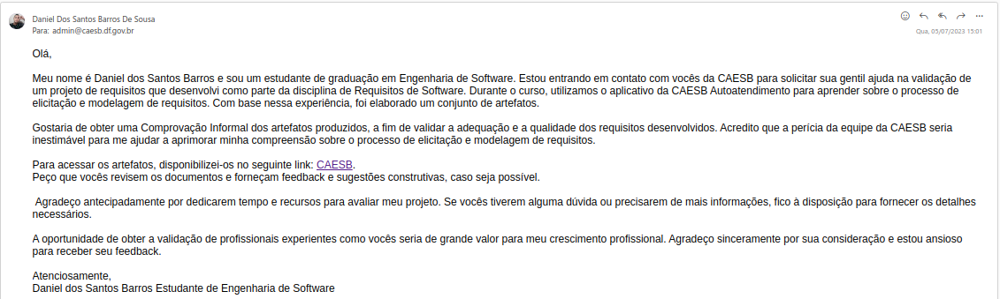

# Validação

## Introdução
Durante a vida do projeto, ele passa por duas fases imprescindíveis para saber se atende ao que se será desejado, sendo elas a verificação e a validação. Nesse momento, ele se encontra na segunda parte, a de validação, e uma das estratégias para se realizar essa atividade é a comprovação informal, que para ser executada, o grupo entrou em contato com os administrados do aplicativo CAESB Autoatendimento.

## Metodologia

O método de comunicação adotado foi via contato dos administradores a partir do e-mail disponibilizado na loja de aplicativos playstore dos desenvolvedores do aplicativo. Onde o integrante do grupo responsável por esse contato usara seu e-mail da UnB, pois isso ira passar mais autenticidade ao se informar os desenvolvedores que se trata de um projeto de alunos universitários.

## Mensagem
Na Figura 1 é apresentado a mensagemm que foi anviada para a equipe da CAESB.

Figura 1 - Mensagem enviada para a CAESB. (Fonte: Autor)

## Conclusão
Até o momento - 05/07/2023, não foi obtido resposta da validação dos artefatos do projeto, caso posteriormente o grupo seja respondido, essas respostas serão registradas nesse artefato.

## Bibliografia

> SERRANO, Milene, SERRANO, Maurício. Análise de Requisitos (Aula 23). UnB Gama, Brasília, 2023.

## Histórico de Versão

| Data | Data Prevista de Revisão | Versão | Descrição | Autor | Revisor |
| :--: | :--: | :--: | :--: | :--: | :--: |
| 05/07/2023 | 05/07/2023 |  1.0   | Criação do documento | [Daniel](https://github.com/daniel-de-sousa) | [Pedro](https://github.com/pedrobarbosaocb) |