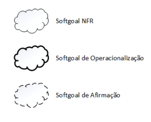
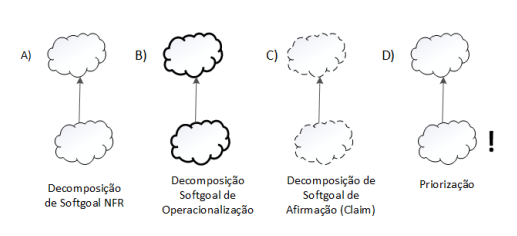
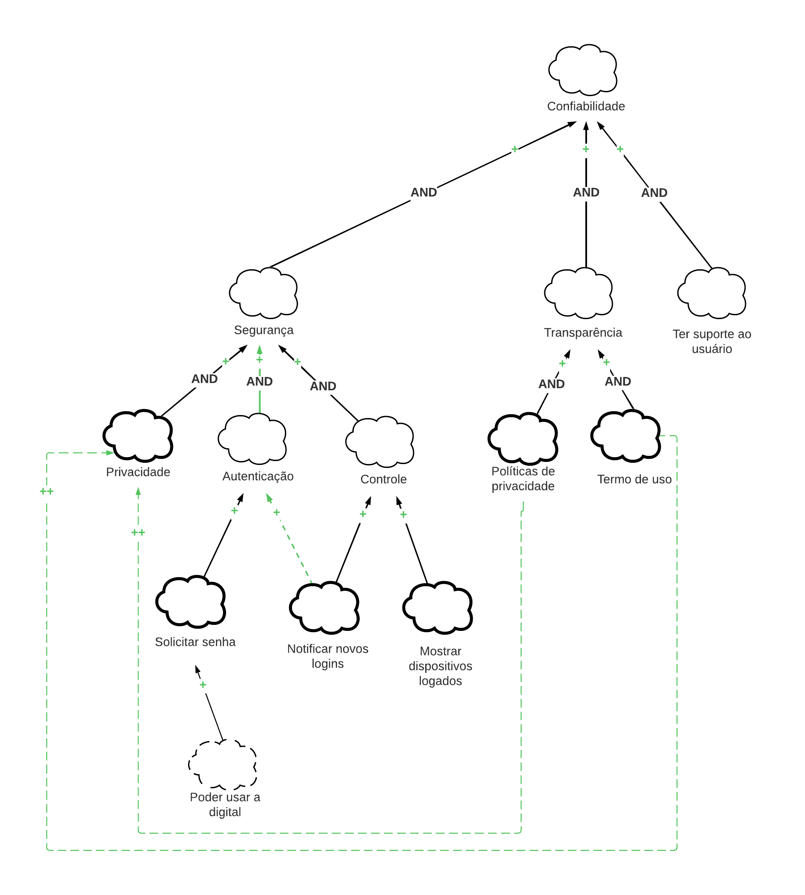
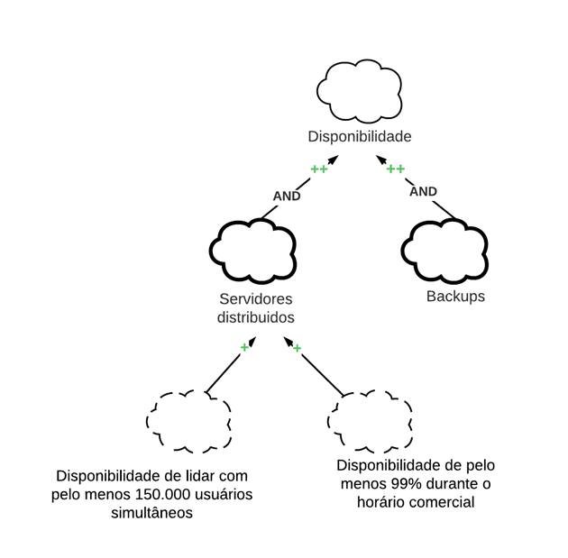
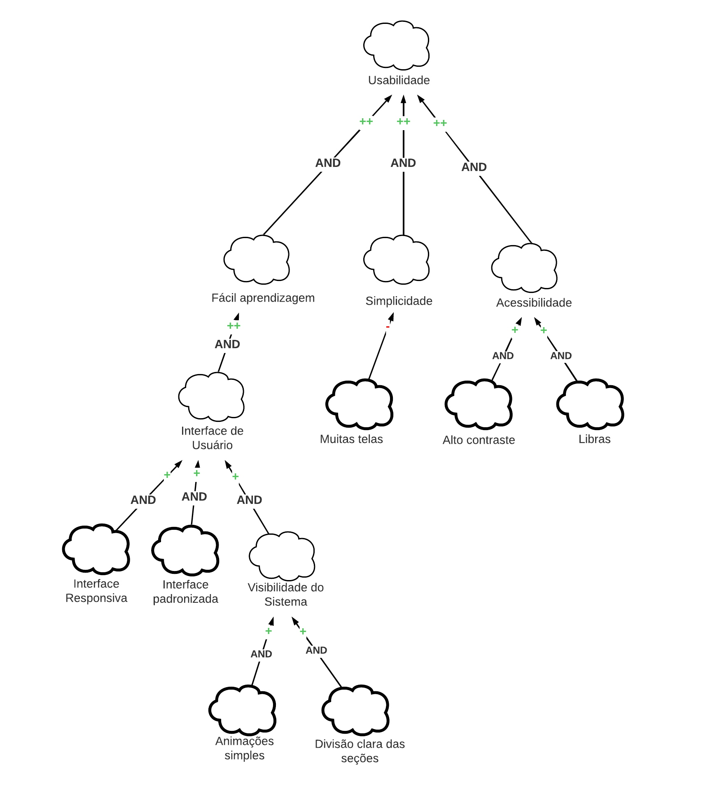

# NFR Framework

## Introdução

A presente documentação tem como objetivo detalhar e disponibilizar representações e diagramas dos Requisitos Não-Funcionais (NFRs) do projeto, fornecendo uma visão abrangente das características e restrições que devem ser consideradas no desenvolvimento e na operação deste sistema. Os NFRs desempenham um papel fundamental na definição dos critérios de qualidade, desempenho e usabilidade que o sistema deve atender, além de guiar a arquitetura, o design e a tomada de decisões ao longo do processo de desenvolvimento. 

## Metodologia

O Framework utiliza o conceito de softgoal: um objetivo ou função que não possui uma clara definição nem critérios de satisfação precisos. Os softgoals podem ser utilizados para representar Requisitos Não-Funcionais, de Operacionalização ou de Afirmação, e podem estar inter-relacionados, expressando a influência de um softgoal em outro. Os softgoals e os seus inter-relacionamentos são representados em um grafo de interdependência de softgoals chamado Softgoal Interdependency Graph (SIG).

### Softgoals
Como definido por CHUNG, no livro Non-functional requirements
in software engineering, existem três tipos de softgoals: Softgoals NFR, Softgoals de Operacionalização e Softgoals de Afirmação, aos quais estão descritos a seguir:

 - Softgoals NFR: representam os Requisitos Não-Funcionais e podem estar interrelacionados, organizados em catálogos e apresentados de forma hierárquica no desenvolvimento do projeto.

 - Softgoals de Operacionalização: representam soluções de implementação para
satisfazer softgoals NFR ou outros softgoals de operacionalização. Essas soluções
incluem operações, processos, representações de dados, estruturações e restrições
no sistema alvo para atender às necessidades indicadas pelos softgoals NFR e de
operacionalização.

 - Softgoals de Afirmação: permitem que as características do domínio (como prioridades e carga de trabalho) sejam consideradas e devidamente refletidas no processo de tomada de decisão. Eles servem como justificativa para apoiar ou negar a forma como os softgoals são priorizados, refinados e os componentes são selecionados. Os softgoals de afirmação fornecem as razões para as decisões de desenvolvimento, facilitando a revisão, a justificativa e a mudança do sistema, bem como o aprimoramento da rastreabilidade.

 

<figcaption>
    Figura 1: Representação gráfica softgoals (Fonte: CHUNG et al., 2000)
</figcaption>

### Interdependências

As interdependências definem as relações entre os softgoals. Os tipos de interdependências utilizadas pelo framework são os refinamentos e as contribuições.

#### Refinamento
Os refinamentos definem um tipo de interdependência que ocorre de cima para baixo (TOP-DOWN), onde um softgoal ascendente (pai) produz um ou mais softgoals descendentes (filhos) e estes se relacionam com o ascendente. Os tipos de refinamento são: decomposição, operacionalização e afirmação.
As decomposições têm o objetivo de refinar softgoals para obter softgoals mais especializados e estes possam auxiliar na construção do projeto. Os quatro tipos de decomposições utilizadas pelo NFR Framework são descritos a seguir:

 * Decomposição de Softgoal NFR
 * Decomposição de Operacionalização
 * Decomposição de Afirmação (Claims)
 * Priorização ( ! )

 
 

<figcaption>
    Figura 2: Representação gráfica dos tipos de decomposição (Fonte: CHUNG et al., 2000)
</figcaption>

 

#### Contribuições
  
No NFR framework é possível a utilização de diversos tipos de contribuições que descrevem como a satisfação ou não de um softgoal descendente contribui para a satisfação do softgoal ascendente. A seguir apresentamos os tipos de contribuição utilizadas pelo framework:

- **AND**: Caso os softgoals descendentes sejam satisfeitos, serão também os ascendentes.
- **OR**: Caso algum softgoal descendentes seja satisfeitos, será também os ascendente.
- **MAKE (++)**: Caso o softgoal descendente for suficientemente satisfeito, será também o
ascendente, porém, a contribuição é fornecida como suficientemente positiva concebida no
nível mais alto de satisfação.
- **HELP (+)**: Caso o softgoal descendente seja parcialmente satisfeito, será parcialmente
satisfeito o ascendente.
- **HURT (-)**: Caso o softgoal descendente seja satisfeito, o softgoal ascendente será
parcialmente negado.
- **UNKOWNN(?)**: Fornece uma contribuição desconhecida entre um softgoal descendente e um softgoal ascendente, podendo ser tanto positiva quanto negativa.
- **BREAK(--)**: Fornece uma contribuição suficientemente negativa (BREAK) entre um softgoal descendente e um softgoal ascendente que é concebida no nível mais alto de negação. Portanto, ao utilizar BREAK, se o softgoal descendente for suficientemente satisfeito o softgoal pai será negado, ou seja não será satisfeito.
- **EQUALS**: Determina que o softgoal descendente só será satisfeito se o softgoal ascendente for satisfeito e que softgoal descendente será negado se o softgoal ascendente for negado.
- **SOME** É utilizada quando o sinal da contribuição é conhecido (positivo ou negativo), mas a extensão (parcial ou total) não é. Nesses casos, quando há alguma incerteza em se utilizar HELP ou MAKE deve-se utilizar o tipo de contribuição SOME (+). Da mesma forma quando não há certeza em se utilizar HURT ou BREAK deve-se utilizar SOME (-).

## Gráficos de Interdependência de Softgoals (SIG)
Os Requisitos Não-Funcionais presentes no projeto e representados pelo Framework tiveram como base a [Especificação Suplementar](../especificacao_suplementar.md) e os [Requisitos Priorizados](../../Elicitacao/priorizacao-FTF.md).

Os Gráficos de Interdependência de Softgoals foram dispostos conforme a metodologia FURPS+ e foram construidos com a ferramenta [Lucidchart](https://www.lucidchart.com/). Os NFRs  representados peloS SIGs são o de [Confiabilidade](#sig-de-confiabilidade) (Figura 3), [Disponibilidade](#sig-de-disponibilidade) (Figura 4) e [Usabilidade](#sig-de-usabilidade) (Figura 5). 

### SIG de Confiabilidade

<figcaption>
    Figura 3: SIG de Confiabilidade (Fonte: Raquel, 2023)
</figcaption>

 

### SIG de Disponibilidade

<figcaption>
    Figura 4: SIG de Disponibilidade (Fonte: Raquel, 2023)
</figcaption>

 

### SIG de Usabilidade

<figcaption>
    Figura 5: SIG de Usabilidade (Fonte: Raquel, 2023)
</figcaption>

 

## Bibliografia
>SILVA, Reinaldo Antônio da. NFR4ES: Um Catálogo de Requisitos Não-Funcionais para Sistemas Embarcados. 2019. Disponível em: https://repositorio.ufpe.br/handle/123456789/34150. Acesso em: 22 de Maio de 2023.

>SERRANO, Milene; SERRANO, Mauricio. Slides da aula de Requisitos – Aula 17. 2019. Acesso em: 22 de Maio de 2023.

>CHUNG, L.; NIXON, B. A.; YU, E.; MYLOPOULOS, J. Non-functional requirements
in software engineering. Springer Science & Business Media: [s.n.], 2000. v. 5.

>Requisitos de Software - 2022.2-Moodle. Disponível em: https://github.com/Requisitos-de-Software/2022.2-Moodle/blob/main/docs/Modelagem/NRFframework.md. Acesso em: 22 de Maio de 2023.

>

## Histórico de Versão

| Data | Data Prevista de Revisão | Versão | Descrição | Autor | Revisor |
| :--: | :----------------------: | :----: | :-------: | :---: | :-----: |
| 22/05/2023 | 23/05/2023 |  1.0   | Criação do Documento | [Caetano](https://github.com/caeslucio) e [Raquel](https://github.com/raqueleucaria) |  [Paulo](https://github.com/PauloVictorFS) |