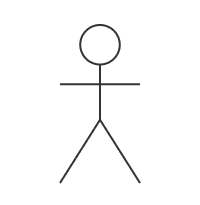
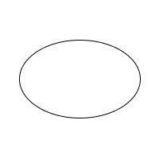
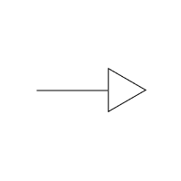

# Casos de Uso

## Introdução
Os casos de uso têm como intuito, descrever as as ações dos usuários para realizar certas tarefas no sistema, por meio da representação de uma sequência de passos simples e objetivos. Explicitando desde o objetivo do usuário até as respostas que o sistema terá a cada interação.

## Passo a Passo
Passo a passo para a formulação dos casos de uso.

1. Identifique quem estará usando o aplicativo;
2. Selecione um desses usuários;
3. Defina o objetivo do usuário ao utilizar o sistema. E cada ação realizada a partir do site realizada por ele será um caso de uso;
4. Para cada caso de uso, decida quando o usuário está o utilizando;
5. Descreva os passos para o usuário chegar naquele caso de uso e cada resposta do sistema para o usuário para cada caso de uso;
6. Quando os passos básicos estiverem descritos, analise outros caminhos para chegar em cada caso de uso adicionando a descrição de _extend_ para aqueles que extendem casos de uso gerais;
7. Procure e retire os casos de usos que realizam funções comuns;
8. Repita os passos 2 e 7 para todos os outros usuários.

## Motivação
A utilização de casos de uso em um projeto é de extrema importância devido ao seu papel crucial na compreensão dos requisitos do sistema. Por meio dos casos de uso, é possível identificar as funcionalidades essenciais e as interações entre os atores e o sistema de forma clara e concisa. Assim, a elaboração de um artefato de casos de uso se torna fundamental para capturar, comunicar, validar e orientar os requisitos de software de maneira eficiente e eficaz.

## Diagrama UML de Casos de Uso
O diagrama de Casos de Uso, representa os caminhos de utilização do e resposta do sistema, com relação a visão do usuário. Por meio da Figura 1, podemos observar o diagrama de casos de uso do aplicativo da CAESB.

 Figura 1: Diagrama de Casos de Uso (Fonte: autores, 2023).

## Legendas e elementos do Diagrama de Casos de Uso

Nessa seção, a Tabela 1 tem como objetivo auxiliar o entendimento dos elementos presentes no diagrama de casos de uso.

|Elemento|Descrição|
|-|-|
||(Bonecos de Palito)   Representa os Atores/Personagens participantes da execução do sistema|
|| (Elipses)   Contém cada Caso de Uso do aplicativo|
|| (Setas)   Representa a relação dos casos de uso entre eles e entre as personegens participantes do sistema|
|| (Retângulos)   Representa uma seção do sistema/ou todo o sistema|

 Tabela 1: Legenda Diagrama de Casos de Uso (Fonte: autores, 2023).

## Especificação de Casos de Uso
Abaixo, representado pelas tabelas 3 à 8, segue as especificações para os principais casos de uso do diagrama de casos de uso. Para melhor entendimento, a tabela 2 detalha cada seção dos casos de uso.

|Caso de Uso 00 |   Nome    |
|---------------|-------|
|Descrição      |       Descrição breve da tarefa de interesse realizada no caso de uso    |
|Atores         |       Personagens que atuam para a realização dessa tarefa   |
|Pré-condições  |       Requisitos básicos para que a tarefa seja realizada |
|Fluxo Principal|       Como o nome diz, é o principal caminho tomado para se realizar a tarefa |
|Fluxos Alternativos|   Caminhos alternativos que chegam na realização da tarefa |
|Fluxos de exceção|     Caminhos que levam ao impedimento pelo sistema da realização da tarefa |
|Pós-condições  |       Resultado ao se realizar a tarefa    |

 Tabela 2: Detalhamento dos casos de uso (Fonte: autores, 2023).

### UC01 - Visualizar fatura

|Caso de Uso 01 |   Visualizar fatura    |
|---------------|-------|
|Descrição      |       O usuário deve ser capaz de visualizar a fatura da sua conta    |
|Atores         |       Usuário    |
|Pré-condições  |       O aplicativo deve estar instalado  Deve haver conexão com a internet  O usuário deve estar logado em sua conta  O usuário deve ter um imóvel vinculado ao seu cadastro   |
|Fluxo Principal|       1. Acessar segunda via da fatura   2. Selecionar imóvel  3. Selecionar fatura aberta  4. Selecionar forma de pagamento |
|Fluxos Alternativos|   Não há |
|Fluxos de exceção|     1. Acessar segunda via da fatura   2. Selecionar imóvel  3. Não havendo faturas abertas o sistema apresentará as faturas pagas sem a opção de realizar pagamento |
|Pós-condições  |       O usuário acessou a fatura e realizou o pagamento    |

 Tabela 3: Caso de Uso 1 (Fonte: autores, 2023).

### UC02 - Visualizar histórico de pagamentos

|Caso de Uso 02 |   Visualizar histórico de pagamentos    |
|---------------|-------|
|Descrição      |       O usuário deve ser capaz de visualizar seu histórico de pagamentos    |
|Atores         |       Usuário    |
|Pré-condições  |       O aplicativo deve estar instalado  Deve haver conexão com a internet  O usuário deve estar logado em sua conta  O usuário deve ter um imóvel vinculado ao seu cadastro    |
|Fluxo Principal|       1. Acessar segunda via da fatura   2. Selecionar imóvel   |
|Fluxos Alternativos|   Não há |
|Fluxos de exceção|     O aplicativo mostra somente os períodos que há registro de fatura |
|Pós-condições  |       O usuário teve acesso ao seu histórico de faturas e observou se existe faturas pendentes    |

 Tabela 4: Caso de Uso 2 (Fonte: autores, 2023).

### UC03 - Informar vazamento

|Caso de Uso 03 |   Informar vazamento    |
|---------------|-------|
|Descrição      |       O usuário deve poder relatar um vazamento    |
|Atores         |       Usuário    |
|Pré-condições  |       O aplicativo deve estar instalado  Deve haver conexão com a internet    |
|Fluxo Principal|       1. Acessar aba de denuncia de vazamento  2. Selecionar endereço do vazamento  |
|Fluxos Alternativos|   1. Acessar conta  2. Acessar aba de denuncia de vazamento  3. Selecionar endereço do vazamento |
|Fluxos de exceção|     Não há |
|Pós-condições  |       O usuário informou o vazamento e foi atualizado sobre a ciencia e/ou resolução do vazamento  |

 Tabela 5: Caso de Uso 3 (Fonte: autores, 2023).

### UC04 - Agendar leitura de hidrômetro

|Caso de Uso 04 |  Agendar leitura de hidrômetro     |
|---------------|-------|
|Descrição      |       O usuário pode agendar uma leitura do hidrômetro   |
|Atores         |       Usuário    |
|Pré-condições  |       O aplicativo deve estar instalado  Deve haver conexão com a internet  O usuário deve estar logado em sua conta  O usuário deve ter um imóvel vinculado ao seu cadastro   |
|Fluxo Principal|       1. Acessar aba de agendar leitura do hidrômetro 2. Escolher uma data e hora para a leitura do hidrômetro   |
|Fluxos Alternativos|   Não há |
|Fluxos de exceção|     O aplicativo não deixa abertura para agendamento anterior a data de solicitação do serviço |
|Pós-condições  |       O usuário agendou a leitura do hidrômetro pela CAESB e foi notificado sobre a leitura   |

 Tabela 6: Caso de Uso 4 (Fonte: autores, 2023).

### UC05 - Informar falta de água

|Caso de Uso 05 |       Informar falta de água     |
|---------------|----------------------------------|
|Descrição      |       O usuário pode informar à CAESB sobre a falta de água em sua residência   |
|Atores         |       Usuário   |
|Pré-condições  |       O aplicativo deve estar instalado  Deve haver conexão com a internet  O usuário deve estar logado em sua conta    |
|Fluxo Principal|       1. Acessar aba de informar falta de água 2. Informar o endereço   |
|Fluxos Alternativos|   1. Acessar conta  2. Acessar aba de informar falta de água  3. Selecionar endereço da falta de água |
|Fluxos de exceção|     Não há |
|Pós-condições  |       O usuário informou a CAESB sobre a falta de água e foi notificado sobre o andamento do processo de resolução   |

 Tabela 7: Caso de Uso 5 (Fonte: autores, 2023).

### UC06 - Visualizar histórico de consumo de água

|Caso de Uso 06 |    Visualizar histórico de consumo de água   |
|---------------|-------|
|Descrição      |       O usuário pode visualizar o seu histórico de consumo de água |
|Atores         |       Usuário   |
|Pré-condições  |       O aplicativo deve estar instalado  Deve haver conexão com a internet  O usuário deve estar logado em sua conta  O usuário deve ter um imóvel vinculado ao seu cadastro  |
|Fluxo Principal|       1. Acessar aba de visualizar histórico de consumo de água" 2. Selecionar o período desejado  3. Selecionar número de pessoas residentes na casa   |
|Fluxos Alternativos|   Não há |
|Fluxos de exceção|     Ao tentar colocar um número menor que um em "pessoas que moram na residência" o botão de diminuir se torna inativo |
|Pós-condições  |       O usuário pode visualizar o seu histórico de consumo de água   |

 Tabela 8: Caso de Uso 6 (Fonte: autores, 2023).

## Validação do Diagrama de Casos de Uso
Um dos pontos essenciais para a Engenharia de Requisitos é a validação dos artefatos com o cliente, na qual tem como intuito entender se o que está sendo produzido está de acordo com o que é esperado pelo cliente. Com isso, os casos de uso presentes neste artefato foram elaborados e validados a partir da interpretação de duas personas, presentes na Tabela 9.

|Nome	|Idade	|Ocupação	|Cidade/Estado |
|--	|--	|--	|--	|
|Ana Paula Silva	|30	| Estudante e Estagiária |Distrito Federal, Brasília |
|Guilherme Silva Andrade |25 | Estudante e Atendente da loja de chinelos	|Distrito Federal, Brasília |

 Tabela 9: Personas para os casos de uso. (Fonte: <a href="../../Elicitacao/personas/#montagem-das-personas">Montagem das Personas</a>, 2023)

## Referências
> O que é UML e Diagramas de Caso de Uso: Introdução Prática à UML. Disponível em [link](https://www.devmedia.com.br/o-que-e-uml-e-diagramas-de-caso-de-uso-introducao-pratica-a-uml/23408).

> Use Cases. Disponível em [link](https://www.usability.gov/how-to-and-tools/methods/use-cases.html).

## Histórico de Versão

| Data | Data Prevista de Revisão | Versão | Descrição | Autor | Revisor |
| :--: | :--: | :--: | :--: | :--: | :--: |
| 09/05/2023 | 14/05/2023 |  1.0   | Elaboração do Diagrama de Casos de Uso | [Guilherme](https://github.com/guilhermekishimoto) e [Pedro](https://github.com/pedrobarbosaocb) |  [Paulo](https://github.com/PauloVictorFS) |
| 14/05/2023 | 15/05/2023 |  1.1   | Correção dos casos de uso de acordo com a revisão | [Guilherme](https://github.com/guilhermekishimoto) e [Pedro](https://github.com/pedrobarbosaocb) |  [Paulo](https://github.com/PauloVictorFS) |
