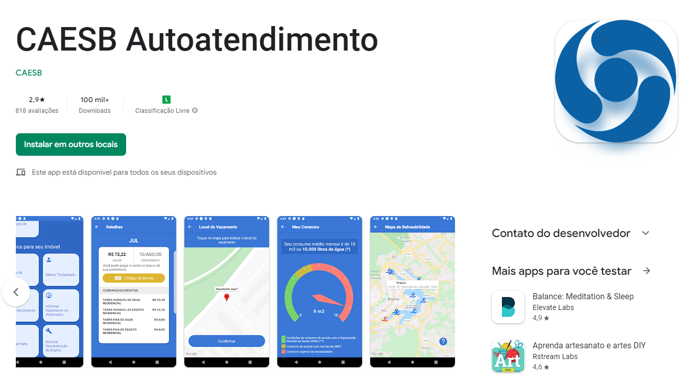
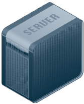

# Aplicativo Escolhido
## Introdução
Todo artefato a ser produzido neste projeto, será feito a partir de um aplicativo específico, escolhido pelo grupo. Com isso, este documento visa introduzir o aplicativo escolhido pelo grupo, de acordo com a análise individual de diferentes plataformas sugeridas, seguindo os critérios da disciplina.

## Metodologia
A escolha do aplicativo analisado neste projeto ocorreu por meio do estudo e análise individual de cada membro (Tabela 1). Reunindo os Rich Pictures e estudos elaborados, o grupo acordou sobre o aplicativo escolhido definindo os motivos de escolha e o Rich Picture relacionado. 

## Aplicativos analisados

Para o projeto da disciplina se tornou necessário a escolha de um aplicativo para ser trabalhado, para isso, foi aproveitado os aplicativos analisados individualmente por cada membro e dentre estes foi feito a escolha daquele que foi julgado como sendo a melhor opção a ser trabalhada pela equipe. Sendo que para isso, cada membro fez uma Rich Picture do seu aplicativo analisado, que podem ser acessadas pelos links presentes na Tabela 1.

| Nome                | Aplicativo            | Rich Picture     |
| ------------------- | --------------------- | ---------------- |
| Carla de Araujo     | GitHub                | [Rich Picture](https://drive.google.com/file/d/1SJRAn2ASOPUSXnSuscGr-pjjEfK-BPgY/view?usp=share_link) |
| Daniel dos Santos   | CAESB Autoatendimento | [Rich Picture](https://drive.google.com/file/d/1CuFWHoOKZDq4fLVm9LQTqiH-DdYcI1T_/view?usp=share_link) |
| Guilherme Kishimoto | Serasa                | [Rich Picture](https://drive.google.com/file/d/1ZFXA6dZIuI6I9JvBt2IKDViA88IhICRp/view?usp=share_link) |
| Paulo VIctor        | LibreOffice Reader    | [Rich Picture](https://drive.google.com/file/d/1O6a4WsyZZGpi5hMXnucT-9sKm2f_6a-7/view?usp=share_link) |
| Pedro Barbosa       | iLovePDF              | [Rich Picture](https://drive.google.com/file/d/1Tl43CzS2VdOyFZoEIta61nIZBAEW4nTe/view?usp=share_link) |
| Raquel Eucaria      | Acolha-se             | [Rich Picture](https://drive.google.com/file/d/1bJn8Yg8jbbtKxEbVHLiRroGd-4yGiil8/view?usp=share_link) |

Tabela 1: Aplicativos Avaliados por Membro. (Fonte: autores, 2023).

## Critérios da Disciplina
Para poder ser usado na disciplina o aplicativo precisaria passar pelos seguintes critérios decididos pelo professor:

- O aplicativo não poderia ter sido trabalhado anteriormente na disciplina de Requisitos de Software
- O aplicativo precisa ser um software livre ou do governo, e deve  permitir a engenharia reversa e análise completa deste
- O aplicativo deve ser profundo o sufiicente para poder ser realizado uma análise completa

## Motivos para a Escolha
Depois de passar pelos critérios, o grupo optou por seguir o projeto com o aplicativo da CAESB Autoatendimento, impulsionados pelos seguintes motivos:

- O aplicativo não é muito complexo para apresentar uma grande lista de requisitos, nem muito simles para apresentar poucos requisitos
- Por ser um aplicativo governamental, a possibilidade de se ter contato com os usuários é elevada
- Possui uma variedade de funções suficiente para ser realizado uma análise vasta e completa
- A empresa CAESB possui alguns métodos de contato que podem vim a ser usados para a validação de requisitos

## Caesb
O aplicativo da CAESB (Companhia de Saneamento Ambiental do Distrito Federal) foi criado com o objetivo de se ter praticidade, permitindo que o usuário tenha acesso a diversos recursos, como:

* Avisos sobre a Falta de Água.
* Qualidade de Água em Lagos.
* Informações em Geral para os Usuários.

Como também permite que o usuário ajude o trabalho da CAESB pelo recurso de poder informar onde se tem um vazamento para que possa ser corrigido.
A paritr do momento que o usuário se conecta, também é possível ter acesso a outros serviços, como:

* 2° Via de Conta.
* Informar Falta de Água.
* Alterar Titularidade.
* Entre outros.

A seguir na Figura 1 a pagina do aplicativo da CAESB que pode ser encontrado na [Play Store](https://play.google.com/store/apps/details?id=br.gov.df.caesb.mobile).

    Figura 1: Aplicativo da CAESB. (Fonte: Autor, 2023).

## Rich picture

Rich Picture é um modelo informal com o objetivo de auxiliar a indentificação de processos de négocios e seus requisitos, como também dos autores envolvidos nos processos, suas responsabilidades e seus relacionamentos.
Então na Figura 2, se tem a primeira versão feita para o Rich Picture do aplicativo da CAESB.

    Figura 2: CAESB Autoatendimento Rich Picture. (Fonte: Autor, 2023).

Tendo em vista esa primira, foi realizada uma revisãa, sendo apontadas as seguintes características a serem consideradas para se realizar uma nova versão:

### Revisão Rich Picture

#### Introdução

O objetivo desse artefato é revisar a versão 1 da Rich Picture.

#### A corrigir

1. Não precisa mostrar o fluxo do programa, por exemplo, as operações que, no aplicativo, precisam efetuar login para que seja utilizada estão sendo representadas após a operação entrar, essas operações dependentes do login devem estar ligadas diretamente ao usuário.
2. Algumas operações deveriam ser armazenamento de dados, por exemplo, "2 via da conta" e esta deve ficar ligada diretamente ao usuário através da operação visualizar.
3. O armazenamento de dados “banco de dados” não deve representar um armazenamento de dados, deve ser apenas uma representação, utilizando apenas uma imagem que a represente.
4. O armazenamento de dados “dados do usuário” deve ser representada pelo próprio banco de dados, não sendo considerado uma operação.
5. A operação “2ª via da conta”, que deveria ser um armazenamento de dados deve ter uma seta ligando o banco de dados nela.
6. O armazenamento de dados “solicitações” não deve ser um armazenamento de dados e sim uma operação ”solicitar”.

Diante disso se tem a nova versão atualizada do Rich Picture, que pode ser encontrado na Figura 3:

    Firgura 3: CAESB Autoatendimento Rich Picture. (Fonte: Autor, 2023).

|Legenda|   |   |   |   |   |   |
|-------|---|---|---|---|---|---|
|Atores|Banco de dados|Fronteira do Sistema|Operações|Servidor|Tabelas|Setas
|| ||||||

    Tabela 2: Legenda da Rich Picture. (Fonte: Autor, 2023).

## Bibliografia
> CTEC2402. Introducting to Rich Picture - Rich Picture Drawing Guidelines. 

## Histórico de Versão
|    Data    | Data Prevista de Revisão | Versão |      Descrição       |                                         Autor                                          |               Revisor               |
| :--------: | :----------------------: | :----: | :------------------: | :------------------------------------------------------------------------------------: | :---------------------------------: |
| 14/04/2023 |        15/04/2023        |  1.0   | Criação do documento | [Paulo](https://github.com/PauloVictorFS) e [Raquel](https://github.com/raqueleucaria) | [Carla](https://github.com/ccarlaa) |
| 14/04/2023 |        15/04/2023        |  2.0   | Adicionando a Rich Picture e fazendo correções | [Daniel](https://github.com/daniel-de-sousa), [Guilherme](https://github.com/guilhermekishimoto) e [Raquel](https://github.com/raqueleucaria) | [Carla](https://github.com/ccarlaa) |
| 25/04/2023 |        26/04/2023        |  2.1   | Fazendo correção de textos, tabelas e links | [Daniel](https://github.com/daniel-de-sousa) | [Raquel](https://github.com/raqueleucaria) |
| 03/07/2023 |        04/07/2023        |  3.0   | Fazendo correção de textos, tabelas e links | [Pedro](https://github.com/pedrobarbosaocb) | [Daniel](https://github.com/daniel-de-sousa) |