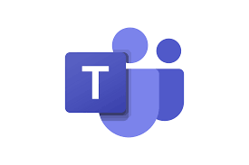

# Ferramentas

## Introdução
No contexto de trabalho em grupo, o uso de ferramentas desempenha um papel fundamental na ampliação da produtividade e eficiência. Essas ferramentas são essenciais para possibilitar a realização de tarefas de maneira mais eficaz e ágil. Neste documento, serão apresentadas e exploradas algumas das principais ferramentas utilizadas, que visam otimizar o desempenho do grupo, facilitar a colaboração e impulsionar os resultados alcançados.

## Objetivo
Este artefato apresenta as ferramentas utilizadas pelo grupo no projeto, escolhidas com base na funcionalidade por elas proporcionada, e familiaridade dos participantes. A tabela 1, apresenta cada ferramenta utilizada, exibindo seus logotipos, descrições e motivos de escolha. 

## Metodologia
A discussão acerca das ferramentas a serem utilizadas no projeto ocorreu na [1ª Reunião](https://requisitos-de-software.github.io/2023.1-Caesb/Atas/Reuniao01/) realizada pelo grupo, no dia 09/04/2023. Nesse sentido, foram definidas as ferramentas apresentadas neste artefato.

## Ferramentas utilizadas

| Logo | Ferramenta | Descrição | Motivo da Escolha |
| --- | --- | --- | --- |
|  | [GitHub](https://docs.github.com/en/get-started/quickstart/hello-world) [1] | Software de versionamento de documentos que também atua como repositório para armazenar os arquivos produzidos. | Como critério da disciplina o deploy, armazenamento e manutenção do projeto devem ocorrer por meio desta plataforma. |
|  | [Telegram](https://telegram.org/) [2] | Software de mensagens para facilitar a comunicação constante e ágil de um grupo. | Todos os participantes do grupo estão familiarizados com a ferramenta. |
|  | [Microsoft Teams](https://www.microsoft.com/en-us/microsoft-teams/log-in) [3] | Software de comunicação e colaboração projetada para conectar equipes e permitir a realização de videoconferências, compartilhamento de arquivos e de tela e gravação das reuniões. | Todos do grupo estão familiarizados com a ferramenta, devido a disponibilização da licença de estudante proporcionada pela UnB. |
|  | [Visual Studio Code](https://code.visualstudio.com/docs) [4] | Software de manipulação de código-fonte e manipulação de arquivos. Oferece a possibilidade de personalização através de extensões, tornando-o uma ferramenta altamente flexível e adaptável. | O VSCode é a IDE mais utilizada dentre os participantes deste projeto. |
|  | [YouTube](https://youtube.com/) [5] | Software de hospedagem de vídeos online | Como critério da disciplina é pedido que sejam disponibilizadas gravações das reuniões e entregas por meio do YouTube. |
|  | [Lucidchart](https://lucidchart.com/) [6] | Software de elaboração de diagramas. Oferece a possibilidade de colaboração em tempo real. | Devido a necessidade de criação de diagramas ao longo do projeto e prévia utilização deste software pelos participantes do projeto. |
|  | [This Person Doesn't Exist](https://this-person-does-not-exist.com/en) [7] | Software que utiliza inteligência artificial para gerar imagens de pessoas que não existem de fato. Amplamente utilizado para a criação de personas em projetos | Devido a necessidade de criação de imagens de pessoas fictícias para as personas do projeto. |
|  | [Google Workspace](https://workspace.google.com/intl/pt-BR/features/?--&gad=1&gclid=CjwKCAjwhdWkBhBZEiwA1ibLmOJTez3_OyN5gkdJBMHZ_MEeZxzCrKYo5v4Ezn9Zj0j5RslMrCIHZxoCBzoQAvD_BwE&gclsrc=aw.ds) [8] | Arcabouço de ferramentas para a produção de planilhas, formulários, organização, etc. | Devido a disponibilização de ferramentas para análise e coleta de dados, de forma gratuita e acessível. |

Tabela 1: Principais ferramentas utilizadas (Fonte: Autor, 2023). 

## Referências Bibliográficas

> [1] GitHub, disponível em [docs.github.com](https://docs.github.com/en/get-started/quickstart/hello-world). 

> [2] Telegram, disponível em [telegram.org](https://telegram.org). 

> [3] Microsoft Teams, disponível em [microsoft.com](https://www.microsoft.com/en-us/microsoft-teams/log-in). 

> [4] Visual Studio Code, disponível em [code.visualstudio.com](https://code.visualstudio.com). 

> [5] YouTube, disponível em [youtube.com](https://youtube.com). 

> [6] Lucid Chart, disponível em [lucidchart.com](https://lucidchart.com). 

> [7] This Person Doesn't Exist, disponível em [this-person-does-not-exist.com](https://this-person-does-not-exist.com/en). 

> [8] Google Workspace, disponível em [workspace.google.com](https://workspace.google.com/intl/pt-BR/features/?--&gad=1&gclid=CjwKCAjwhdWkBhBZEiwA1ibLmOJTez3_OyN5gkdJBMHZ_MEeZxzCrKYo5v4Ezn9Zj0j5RslMrCIHZxoCBzoQAvD_BwE&gclsrc=aw.ds). 

## Bibliografia

> CAESB, Grupo 4. Atas de Reunião. Disponível em: <https://requisitos-de-software.github.io/2023.1-Caesb/Atas/Reuniao01/>

> Wiki Requisitos - Planejamento - Ferramentas. Disponível em: <https://requisitos-de-software.github.io/2022.1-TikTok/ferramentas/>. Acesso em: 14 de abril de 2023. 

> Wiki Requisitos - Planejamento - Ferramentas. Disponível em: <https://requisitos-de-software.github.io/2022.2-Lichess/planejamento/ferramentas/>. Acesso em: 14 de abril de 2023. 

## Histórico de Versão

|    Data    | Data Prevista de Revisão | Versão |      Descrição       |                                                                Autor                                                                 |               Revisor               |
| :--------: | :----------------------: | :----: | :------------------: | :----------------------------------------------------------------------------------------------------------------------------------: | :---------------------------------: |
| 14/04/2023 |        14/04/2023        |  1.0   | Adição das ferramentas do projeto  | [Guilherme](https://github.com/guilhermekishimoto) | [Paulo](https://github.com/PauloVictorFS) |
| 16/04/2023 |        16/04/2023        |  2.0   | Adição de legenda da tabela | [Guilherme](https://github.com/guilhermekishimoto) | [Paulo](https://github.com/PauloVictorFS) |
| 26/04/2023 |        26/04/2023        |  3.0   | Ajuste do artefato de acordo com o feedback recebido | [Guilherme](https://github.com/guilhermekishimoto) | [Paulo](https://github.com/PauloVictorFS) |
| 26/04/2023 |        26/04/2023        |  4.0   | Ajuste de links | [Guilherme](https://github.com/guilhermekishimoto) | [Paulo](https://github.com/PauloVictorFS) |
| 30/04/2023 |        30/04/2023        |  5.0   | Ajuste de links | [Guilherme](https://github.com/guilhermekishimoto) | [Paulo](https://github.com/PauloVictorFS) |
| 23/06/2023 |        25/06/2023        |  6.0   | Correção Pós-verificação | [Pedro](https://github.com/pedrobarbosaocb) | [Paulo](https://github.com/PauloVictorFS) |
