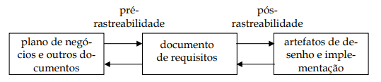

# Matriz de Rastreabilidade

## Introdução

A Gerência de Requisitos, o processo associado à qualidade do desenvolvimento de software, é baseado na rastreabilidade de requisitos. Dessa forma, para um gerenciamento efetivo dos requisitos, será feito a rastreabilidade dos requisitos do Aplicativo da Caesb, unindo a rastreabilidade do **Backward-from** e do **Forward-from**. 

## Objetivo

Compreender melhor os requisitos do projeto com base em seus relacionamentos, e confirmar se eles estão sendo atendidos pelo Software analisando antes e depois da definição da baseline[¹]() do projeto. 

[¹]() Baseline é o conjunto de requisitos que compõe o documento de requisitos. Eles são criados após as várias fases do processo de requisição (elicitação, modelagem, verificação e validação) e compõem a base para o desenho e a implementação do software. No caso da disciplina, observaremos até o desenho (prototipação).

## Metodologia

O rastreamento de requisitos permite uma compreensão mais adequada dos requisitos, por meio das ligações feitas entre requisitos inter-relacionados, requisitos e suas fontes, e entre os componentes que os implementam. Conforme a Figura 1, é possível entender como essa ligações permitem acompanhar todo o processo de um requisito.

 Figura 1 - Rastreabilidadede Requisitos (Fonte: Miriam[1], 2005).

A pré-rastreabilidade trata do ciclo de vida dos requisitos antes de serem definidos, e a pós-rastreabilidade concentra no ciclo de vida após a baseline. Com base nesses conceitos será utilizada a técnica de referência cruzada, que gera uma matriz de rastreabilidade, dando suporte e unindo a pré e a pós-condição de cada requisito.

<!-- Quanto a direção da rastreabilidade, é possível rastrear para frente (Forward) e para trás (Backward), estendendo esses conceitos em:

- **Forward-to:** Origem (plano de negócio e outros documentos) para baseline;
- **Forward-from:** Baseline para desenho do projeto;
- **Backward-to:** Desenho para baseline;
- **Backward-from:** Baseline para origem. 

Com base nesses conceitos será utilizada a técnica de referência cruzada, que consiste na integração de documentos e artefatos utilizados no processo de desenvolvimento. Sendo simples de entender e utilizar, faz uso de hiperlinks, esquema de numeração e indexação. Assim, foi criada uma Matriz de Rastreabilidade que da suporte e une a pré e pós-condição. -->

Na Tabela 1, é apresentado o modelo a ser preenchido na matriz. A primeira coluna apresenta um identificador (ID) seguido do requisito, os artefatos de elicitação, casos de uso ou especificação suplementar, léxicos, cenários e demais artefatos relacionados. Além disso, é apresentado a categoria e o elo (conforme meta-modelo de Toranzo[[2]]()), acrescido da coluna de status sobre a implementação do requisito (se não foi implementado, se foi e se foi desenhado no protótipo). Será criada uma tabela para os requisitos funcionais e outra para não-funcionais. E irão seguir a ordem de priorização, conforme a técnica [First Things First](../Elicitacao/priorizacao-FTF.md).

|ID	|Requisito	|Elicitação	| Especificação Suplementar / Casos de Uso | Léxicos	|História de Usuário	|Backfrom-from	|Forward-from	|Status|
|--|--|--|--|--|--|--|--|--|
|-|-|-|-|-|-|-|-|-|-|

 Tabela 1 - Modelo Matriz de Rastreabilidade Funcionais(Fonte: Miriam[1], 2005).

## Rastreabilidade

A matriz de rastreabilidade foi construida por meio da ferramenta [Google Planilhas](https://docs.google.com/spreadsheets/create?hl=pt-br) e é apresentada neste documento por meio das tabelas Funcionais (Tabela 4) e Não-funcionais (Tabela 5). Sendo possível observar o rastro documental dos requisitos seguindo o modelo adaptado da tabela 1, c. Para melhor entendimento das siglas utilizadas nas Matrizes de Rastreabilidade, confira a Legenda Geral, presente na Tabela 3.
<!-- 

<iframe src="https://docs.google.com/spreadsheets/d/e/2PACX-1vSXsUW6WxyC1JyjJ_Bd8qyke0ghCzfZLWvU6an80kR1UavPJlQ-IIJoLuN8u4TyLD2bBvfadhYdTYya/pubhtml?widget=true&amp;headers=false" width="2400" height="720" frameborder="0"></iframe>

 iFrame 1 - Matriz Geral (Fonte: Autores, 2023).
 -->

### Legendas

| Sigla | Descrição |
| --- | --- |
| Q | Questionário |
| INT | Introspecção |
| ST | Storytelling |
| UC | Caso de Uso |
| L | Léxico |
| C | Cenário |
| US | História de Usuário |

 Tabela 2 - Legenda Geral (Fonte: Autores, 2023).

| Sigla | Descrição | Detalhamento |
| --- | --- | --- |
| IMP | Implementado | Está implementado no aplicativo |
| PTP | Prototipado | Está presente no protótipo por não estar presente no aplicativo |
| INX | Inexistente | Não está presente nem no protótipo nem no aplicativo |

 Tabela 3 - Legenda Status (Fonte: Autores, 2023).

### Funcionais

| ID | Requisito | Elicitação | Casos de Uso | Léxicos | Cenários | História de Usuário | Backfrom-from | Forward-from | Status |
| --- | --- | --- | --- | --- | --- | --- | --- | --- | --- |
| 1 | O usuário deve poder consultar a sua fatura | Q01 e INT03 | UC01 | L07, L11 | -- |  |  |  | IMP |
| 2 | O usuário deve poder pegar a 2ª via da fatura | Q03 | UC01, UC02 | L07, L11 | -- | US06 |  |  | IMP |
| 3 | O aplicativo deve seguir as diretrizes de acessibilidade da WACG 2.1 [1], garantindo que seja acessível para pessoas com deficiência visual, auditiva ou física. | Q07 e INT14 | UC01, UC02, UC03, UC04, UC05, UC06 | L01 | -- | -- |  |  | PTP |
| 4 | O usuário deve poder fazer login com seus dados (CRUD) | INT01 e INT09 | UC01, UC02, UC04, UC06 | L03, L07, L09, L10, L18 | C1, C2, C3, C5, C6 | US21 |  |  | IMP |
| 5 | O usuário deve poder informar sobre vazamentos | Q17 | UC03 | L06 | C4 | US18 |  |  | IMP |
| 6 | O aplicativo deve apresentar uma divisão clara de seções | Q12 | UC01, UC02, UC03, UC04, UC05, UC06 | L01, L04 | -- | -- |  |  | IMP |
| 7 | O aplicativo deve permitir que os usuários visualizem o historico de consumo de água | INT02 e ST04 | UC06 | L05, L07, L09 | C1 | US05, US12 |  |  | IMP |
| 8 | O aplicativo deve padronizar todos os itens que aparecem nas suas seções | Q13 | UC01, UC02, UC03, UC04, UC05, UC06 | L01, L04 | -- | -- |  |  | IMP |
| 9 | O aplicativo deve permitir que o usuário pague suas contas de água utilizando chave pix | INT06 | UC01, UC02 | L16, L17 | -- | US01 |  |  | IMP |
| 10 | O aplicativo deve permitir que o usuário copie o código do boleto | Q05 e ST05 | UC01, UC02 | L16, L17 | -- | US02 |  |  | IMP |
| 11 | Notificar usuário que a fatura está próxima do vencimento | Q02, INT04 e ST01 | UC02 | L11, L13, L15 | C5 | US08 |  |  | IMP |
| 12 | Deve se ter mais detalhe e clareza com relação aos protocolos e serviços | Q14 | UC02, UC06 | L01, L04 | C6 | US13, US16 |  |  | IMP |
| 13 | O aplicativo deve permitir que o usuário pague suas contas de água utilizando cartão de crédito ou débito | INT05 | UC01, UC02 | L16, L17 | -- | US03 |  |  | IMP |
| 14 | Apresentar quando que ocorrerá uma próxima leitura | Q15 | UC04 | L13, L15 | C5 | US11 |  |  | INX |
| 15 | O aplicativo deve permitir que os usuários entrem em contato com a equipe de suporte da CAESB para resolver problemas e fazer perguntas | INT07 e ST06 | UC02, UC03, UC06 | L06 | C4 | US19 |  |  | IMP |
| 16 | O usuário deve poder acessar sua conta por meio de sua impressão digital previamente cadastrada | Q10 | UC01, UC02, UC04, UC06 | L01, L09, L18 | -- | US22 |  |  | INX |
| 17 | O aplicativo deve permitir que o usuário cadastre cartões de crédito/débito | Q04 e ST05 | UC01, UC02, UC04, UC06 | L03, L16, L17 | -- | US04 |  |  | IMP |
| 18 | O usuário deve possuir uma forma de pagamento por cartão que seja automática | Q06 e ST05 | UC01, UC02, UC04, UC06 | L03, L16, L17 | -- | US09 |  |  | INX |
| 19 | A possibilidade de se utilizar cadastros de outras casas, podendo haver, por exemplo, um sistema de troca de contas | Q08 | UC01, UC02, UC03, UC04, UC05, UC06 | L03, L09 | -- | US20 |  |  | INX |

 Tabela 4 - Funcionais (Fonte: adaptado de Miriam[1], 2005).

### Não-funcionais

| ID | Requisito | Elicitação | Cenários | Especificação Suplementar | Léxicos | História de Usuário | Backfrom-from | Forward-from | Status |
| --- | --- | --- | --- | --- | --- | --- | --- | --- | --- |
| 1 | Eu, como usuário, desejo que a quantidade de passos para realizar uma tarefa seja menor que 3 | ST08 | - | U6 | L08 | -- |  |  | INX |
| 2 | Eu, como usuario, desejo que o aplicativo garanta a segurança das minhas informações pessoais e financeiras | ST03 | C1, C2, C3, C4, C5, C6 | SE1 | L18 | US01, US02, US03, US04, US05, US06, US09, US20, US21, US22 |  |  | IMP |
| 3 | O aplicativo deve ser capaz de lidar com pelo menos 150.000 usuários simultâneos sem comprometer o desempenho ou a segurança | INT11 | - | C5 | L08, L18 | US04 |  |  | PTP |
| 4 | O aplicativo deve ter uma taxa de disponibilidade de pelo menos 99% durante o horário comercial | INT12 | - | C6 | L09 | US04 |  |  | IMP |
| 5 | O aplicativo deve ter um procedimento de manutenção que o limite o tempo de inatividade a no máximo 10 horas por mês. | INT13 | - | C7 | L09 | -- |  |  | IMP |
| 6 | O aplicativo deve ser atualizado frequentemente para garantir a correção de erros, melhorias de desempenho e novos recursos. | INT16 | C1, C2, C3, C4, C5, C6 | SU4 | L08, L09 | US03, US04, US08, US11, US19, US22 |  |  | IMP |
| 7 | Eu, como usuário, desejo que o tempo necessário para realizar tarefas seja menor que 1 minuto | ST07 | - | U5 |  | US06, US09, US10, US13, US15, US21, US22 |  |  | IMP |
| 8 | O aplicativo deve funcionar perfeitamente em todos os dispositivos, incluindo computadores. | INT17 | C1, C2, C3, C4, C5, C6 | SU5 | L09, L14 | -- |  |  | IMP |
| 9 | O aplicativo deve permitir que os usuários escolham entre pelo menos 3 idiomas diferentes | INT15 | - | -- | L01, L12 | -- |  |  | IMP |
| 10 | A interface do usuário deve ser intuitiva e de fácil navegação, considerando o perfil diversificado dos usuários. | ES01 | C1, C2, C3, C4, C5, C6 | U1 | L01, L08 | -- |  |  | IMP |
| 11 | O aplicativo deve fornecer feedback claro e mensagens de erro compreensíveis em caso de problemas. | ES02 | C2, C3, C4, C5 | U2 | L04, L18 | US08, US10, US11, US14,  US18, US19 |  |  | IMP |
| 12 | O tempo médio de treinamento para que usuários normais se tornem produtivos em operações básicas do aplicativo não deve exceder 1 hora. | ES03 | - | U3 | L01 | -- |  |  | IMP |
| 13 | O tempo médio para que um usuário solicite a segunda via de uma fatura através do aplicativo deve ser menor que 30 segundos. | ES04 | C1 | U4 | L09 | US01 |  |  | IMP |
| 14 | O aplicativo deve ter uma disponibilidade mínima de 99% durante o horário comercial (das 8h às 18h) para garantir que os usuários possam acessá-lo na maioria das horas de utilização. | ES05 | - | C1 | L09 | -- |  |  | IMP |
| 15 | O MTBF(Mean Time Between Failures) do aplicativo deve ser de pelo menos 170 horas, o que significa que o sistema deve operar continuamente, em média, por pelo menos 170 horas antes de ocorrer uma falha. | ES06 | - | C2 | L08, L09 | -- |  |  | IMP |
| 16 | O MTTR(Mean Time To Repair) do aplicativo que é o tempo máximo permitido para reparo de uma falha do sistema deve ser de 4 horas, ou seja, o sistema deve ser restaurado dentro desse período após uma falha. | ES07 | C5 | C3 | L08, L09 | -- |  |  | IMP |
| 17 | A precisão das informações exibidas nas faturas dos usuários deve ter uma resolução mínima de 2 casas decimais e estar de acordo com as normas contábeis. | ES08 | C1 | C4 | L13, L18 | US01, US02, US03, US04, US05, US06, US07 |  |  | IMP |
| 18 | O tempo médio de resposta para o processamento de uma transação no aplicativo não deve exceder 3 segundos. | ES09 | - | D1 | L08 | US01, US02, US03 |  |  | IMP |
| 19 | O aplicativo deve suportar uma taxa mínima de processamento de 100 transações por segundo para atender à demanda dos usuários. | ES10 | - | D2 | L08 | -- |  |  | IMP |
| 20 | O sistema deve ser capaz de acomodar simultaneamente pelo menos 150.000 usuários conectados ao mesmo tempo, garantindo assim uma capacidade adequada. | ES11 | - | D3 | L09 | -- |  |  | IMP |
| 21 | Quando houver uma queda na conexão de internet do usuário, o aplicativo deve ser capaz de fornecer um modo de degradação, permitindo a execução de funções básicas offline, como visualização de faturas anteriores. | ES12 | - | D4 | L13, L18 | -- |  |  | IMP |
| 22 | O aplicativo deve ser otimizado para minimizar o consumo de memória, garantindo um uso eficiente dos recursos do dispositivo do usuário. | ES13 | - | D5 | L08 | -- |  |  | IMP |
| 23 | O código do aplicativo deve ser desenvolvido de acordo com as diretrizes do padrão de codificação definido pela equipe de desenvolvimento da CAESB. | ES14 | - | SU1 | L18 | -- |  |  | IMP |
| 24 | O aplicativo deve estar disponível para o Android na versão 5.0 | ES15 | C1, C2, C3, C4, C5, C6 | SU2 | L14 | -- |  |  | IMP |
| 25 | O aplicativo deve estar disponível para o IOS na versão 12.0 | ES16 | C1, C2, C3, C4, C5, C6 | SU3 | L14 | -- |  |  | IMP |

 Tabela 5 - Não-funcionais (Fonte: adaptado de Miriam[1], 2005).

## Conclusão

## Referência Bibliográfica

> [1] SAYÃO, Miriam; LEITE, Julio. Rastreabilidade de Requisitos. Monografia em Ciência da Computação n° 20/05, Departamento de Informática, Pontifícia Universidade Católica do Rio de Janeiro. Rio de Janeiro. 2005. Página 4, figura 1.

> [2] SERRANO, Milene; SERRANO, Maurício. Requisitos - Aula 26. Brasília: Unb-Gama, 2017. 44 slides, color. Tipos de Elos da Rastreabilidade, pág. 19. Acesso em: 27 junho 2023.

## Bibliografia

> SERRANO, Milene; SERRANO, Maurício. Requisitos - Aula 26. Brasília: Unb-Gama, 2017. 44 slides, color. Acesso em: 27 junho 2023.

> SAYÃO, Miriam; LEITE, Julio. Rastreabilidade de Requisitos. Monografia em Ciência da Computação n° 20/05, Departamento de Informática, Pontifícia Universidade Católica do Rio de Janeiro. Rio de Janeiro. 2005. Acesso em: 24 jan. 2023.

> GENVIGIR, Elias Canhadas. Um modelo para rastreabilidade de requisitos de software baseado em generalização de elos e atributos. 2009. 200p. Tese (Doutorado em Computação Aplicada) - Instituto Nacional de Pesquisas Espaciais, São José dos Campos, 2009. Acesso em: 27 junho 2023.

## Histórico de versão

|    Data    | Data Prevista de Revisão | Versão | Descrição | Autor |Revisor  |
| :--------: | :-----: | :----: | :------: | :------: | :----: |
|  28/06/2023 | 29/06/2023 | 1.0 | Criação do Documento | [Pedro](https://github.com/pedrobarbosaocb) e [Raquel](https://github.com/raqueleucaria) | -- |