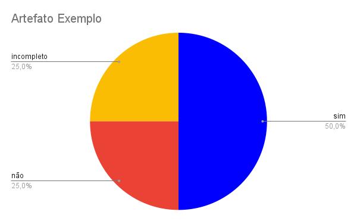

# Planejamento Geral

## Introdução

Segundo a norma internacional ISO/IEC/IEEE 12207:2017(E) (ISO/IEC/IEEE, 2017, p. 82) [1], o objetivo da verificação se define em "prover evidência objetiva que o sistema ou elemento do sistema atende completamente seus requisitos e características especificados". Com isso, afim de garantir qualidade e consistência dos requisitos, realizaremos a verificação dos documentos do nosso grupo, [Caesb](https://requisitos-de-software.github.io/2023.1-Caesb/)[2], da disciplina Requisitos de Software.

## Objetivos
Este documento tem como objetivo estabelecer a organização, padronização e planejamento  do processo de verificação do projeto da Caesb. De forma impessoal, este documento não deseja avaliar os membros do grupo, mas o artefato em si.

## Metodologia
Como método de investigação e produção da verificação, utilizaremos a inspeção, mais especificamente a _Fagan Inspection_. Na qual, segundo Bush [3], consiste na "inspeção de documentos entendidos como prontos para uso e busca por defeitos". Seguindo as etapas de planejamento, visão geral, preparação, inspecção e correção.

## Cronograma
A verificação será realizada no dia 14 de junho de 2023 ao dia 19 de junho de 2023, conforme a Tabela 1. E a distribuição entre os membros para realizar a inspeção está presente na Tabela 2.

| Atividade | Descrição |Local | Participantes | Data |
| :-------: | :---: | :---: |:-----------: | :--: |
| Planejamento em Grupo |Distruibuição dos artefatos, desenvolvimento da tabela padrão para todos os artefatos...| Presencial - UnB | Caetano, Daniel, Guilherme, Paulo, Pedro, Raquel | 06/06/2023 |
| Visão Geral |Reunião em grupo onde foi recapitulado o projeto| Presencial - UnB | Caetano, Daniel, Guilherme, Paulo, Pedro, Raquel | 06/06/2023 |
| Preparação para Inspeção|Elaboração dos checklists conforme bibliografia estabelecida|-|Conforme distribuição (Tabela 2) |14/06/2023-16/06/2023|
| Inspeção|Execução da inspeção|-|Conforme distribuição (Tabela 2)|16/06/2023-17/06/2023|
| Correção|Corrigir os defeitos identificados e registrar o processo|-|Conforme distribuição (Tabela 2)|18/06/2023-20/06/2023|

Tabela 1 - Atividades e cronogrma. (Fonte: Autor)

|Entrega|Avaliador|
|-------|------|
|1      | Daniel |
|2      | Daniel e Raquel | 
|3      | Guilherme e Pedro | 
|4      | Caetano e Paulo | 

Tabela 2 - Distribuição dos membros (Fonte: Autores)

## Artefatos Verificados
Cada entrega possui diversos artefatos, por isso eles devem ver listados e deve-se apresentado a versão analisada, a data do documento e o autor. Conforme o exemplo:
- [Artefato Exemplo]() - Versão X.0 na data XX/XX/XXXX. Autores: [Fulano]()

## Checklist
Os Checklists serão criados com base em uma litetarura de referência que deve ser apresentada em um paragráfo antes do checklist em si. Os quais possuem uma enumeração (ID), para permitir uma melhor identificação, além da pergunta (Descrição), resposta (Avaliação) e um comentário breve (Observação). Para todos os artefatos foram definidas 4 perguntas padrões, as demais perguntas serão desenvolvidas com base na literatura base referente ao artefato, Conforme a Tabela 3.

Justamente com o checklist deve-se fazer um gráfico com a avaliação do artefato, conforme a figura 1. Se for ncessário, deve-se uma justificativa para a avaliação feita, abaixo da tabela, tendo como título o ID e um resumo da pergunta. Além disso se preciso, deve-se apontar sugestões. E por fim fazer uma conclusão da verificação.

## Padronização Exemplo

| ID | Descrição | Avaliação | Observação |
| --- | --- | --- | --- |
| 1 | O artefato possui uma introdução condizente com o conteúdo do texto? || |
| 2 | Todas as bibliografias/referências bibliográficas são utilizadas de forma correta? |  |  |
| 3 | Todas as tabelas e figuras são chamadas no texto, possuem legendas e fontes? |  ||
| 4 | A metodologia esta de acordo com o artefato analisado? |  | |
| 5 | Pergunta x? |  |  |
| 6 | Pergunta y? Se necessário trazer a explicar dos termos citados, no mesmo espaço da pergunta. |  |  |

Tabela 3 - Questões padrões para todos os Artefatos. (Fonte: Autor, 2023)

### Gráfico
Adicionar a imagem do gráfico de pizza das avaliações feitas. (Sim - Não - Incompleto)

### ID 4 - Metodologia
Adicionar justificativa.

### Sugestões
- Listar susgestões.

### Conclusão
Resumir a verificação.

## Referência bibliográfica

> [1] ISO/IEC/IEEE 12207:2017(E) (ISO/IEC/IEEE, 2017, p. 82). Disponível em: https://www.iso.org/obp/ui/#iso:std:iso-iec-ieee:24765:ed-2:v1:en . Acesso em: 13 jun. 2023

> [2] CAESB, grupo 4. Disponível em https://requisitos-de-software.github.io/2023.1-Caesb/ . Acesso em: 16 jun. 2023.

> [3] BUSH, Marilyn, Chris Gerrard, Clifford Shelley. Fagan Inspection: The Silver Bullet No-one Wants to Fire. London SPIN, 25 mar. 2010.

## Bibliografia
> MACIEL, Geovanna. Planejamento da Verificação da Etapa 1 do Grupo 2. Repositório do Grupo Bilheteria Digital da disciplina de Requisitos da Universidade de Brasília, 2023. Disponível em: <https://requisitos-de-software.github.io/2023.1-VLC/#/verificacao/entrega_2/planejamento_verificacao_etapa2>. Acesso em: 16 de Junho de 2023.

> PENHA, Igor, Lucas Gobbi. Planejamento da Verificação da Etapa 2 do Grupo 4. Repositório do Grupo VLC da disciplina de Requisitos da Universidade de Brasília, 2023. Disponível em: <https://interacao-humano-computador.github.io/2022.2-Lichess/verificacao_validacao/pc5-planejamento/>. Acesso em: 16 de Junho de 2023.

> REINEHR, Sheila. Engenharia de requisitos. E-book. ISBN 9786556900674. Disponível em: https://integrada.minhabiblioteca.com.br/#/books/9786556900674/. Acesso em: 13 jun. 2023.

> Sommerville, Ian. Engenharia de software. 08. ed. São Paulo: Pearson Addison Wesley, 2007.

> SERRANO, Milene, SERRANO, Maurício.  Análise de Requisitos (Aula 23). UnB Gama, Brasília, 2023. Disponível no [link](../assets/referencias/Requisitos%20-%20Aula%20023.pdf).

## Historico de Versão
|    Data    | Data Prevista de Revisão | Versão |      Descrição       |                                 Autor                                  |               Revisor               |
| :--------: | :----------------------: | :----: | :------------------: | :--------------------------------------------------------------------: | :---------------------------------: |
| 16/06/2023 |        17/06/2023        |  1.0   | Criação do documento | [Raquel](https://github.com/raqueleucaria) e [Pedro](https://github.com/pedrobarbosaocb) | [Daniel](https://github.com/daniel-de-sousa) |

