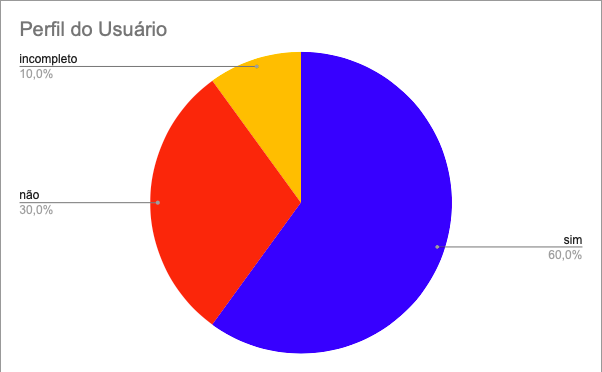

# Perfil do Usuário
## Introdução

Segundo a norma internacional ISO/IEC/IEEE 12207:2017(E) (ISO/IEC/IEEE, 2017, p. 82) [1], o objetivo da verificação se define em "prover evidência objetiva que o sistema ou elemento do sistema atende completamente seus requisitos e características especificados". Com isso, afim de garantir qualidade e consistência dos requisitos, realizaremos a verificação dos documentos do nosso grupo, [Caesb](https://requisitos-de-software.github.io/2023.1-Caesb/)[2], da disciplina Requisitos de Software.

## Objetivos
O objetivo deste documento é realizar a verificação do Perfil do Usuário, artefato da Entrega 2, do Grupo 4, [Caesb](https://requisitos-de-software.github.io/2023.1-Caesb/Elicitacao/perfil_usuario/). De forma impessoal, este documento não deseja avaliar os membros do grupo, mas o artefato em si.

## Metodologia
Como método de investigação e produção da verificação, utilizaremos a inspeção, mais especificamente a _Fagan Inspection_. Na qual, segundo Bush [3], consiste na "inspeção de documentos entendidos como prontos para uso e busca por defeitos". Seguindo as etapas de planejamento, visão geral, preparação, inspecção e correção. Maiores detalhes de planejamento, estão apresentados no [Planejamento da Entrega 2](./0planejamento.md).

## Verificações anteriores
Uma das atividades da disciplina de Requistos de Software, ministrada pelo professor André Barros, é realizar a verificação do projeto de outro grupo. A nossa verificação foi feita sobre o Perfil do Usuário do grupo 5 ([SimpleNote](https://requisitos-de-software.github.io/2023.1-Caesb/Verificacao/Grupo5/Entrega2/elicitacao/questionario/)). E o grupo 3 ([VLC](https://requisitos-de-software.github.io/2023.1-VLC/#/verificacao/entrega_2/perfil_usuario)), fez a inspeção do nosso projeto (Caesb).

Dessa forma, reavaliamos nosso checklist, levando em conta os pontos levantados pelo grupo 3, mas principalmente baseando-se nas literaturas de referência. Assim, um novo checklist foi criado para a avaliação do nosso próprio Perfil do Usuário.

## Checklist
<!-- LIVRO BASE PARA CRIAÇÃO DAS PERGUNTAS -->
Os checklists foram estabelecido com base nos critérios do capítulo 8 do livro Interação humano-computador da Simone Barbosa[[4]](https://aprender3.unb.br/pluginfile.php/2523045/mod_resource/content/2/1_5145791542719414573.pdf). Seguindo as perguntas padrões estabelecidas pelo grupo no [Planejamento Geral](../0planejamento-geral.md), está apresentado na Tabela 1, o checklist da Perfil do Usuário. O checklist foi preenchido com base na versão 2.1 do Perfil do Usuário do grupo 4, [Caesb](https://requisitos-de-software.github.io/2023.1-Caesb/).

<!-- ADICIONAR O CHECKLIST -->

|  ID  | Descrição | Avaliação | Observação |
| :--: | :-------: | :-------: | :--------: |
|  01  | O artefato possui uma introdução condizente com o conteúdo do texto? |Não||
|  02  | Todas as bibliografias/referências bibliográficas são utilizadas no texto? |Não| Não são utilizadas no texto |
|  03  | Todas as tabelas e figuras são chamadas no texto, possuem legendas e fontes? |Não||
|  04  | As metodologias do texto definem de forma condizente as formas e os métodos que o grupo realizou o artefato? |Sim| Poderia criar um tópico separado para metodologia|
|  05  | O método selecionado para elicitar o Perfil do Usuário está correto (entrevistas ou questionários)? |Sim| |
|  06  | O artefato apresenta as características de interesse[¹] do Perfil do Usuário? |Incompleto| Estão apenas na lista de perguntas |
|  07  | As características de interesse do Perfil do Usuário são relevantes para o aplicativo em questão? |Sim|  |
|  08  | O artefato menciona alguns grupos comuns, como idade por exemplo? |Sim| |
|  09  | Os grupos comuns são definidos com base nas características de maior frequência entre os usuários? |Sim| |
|  10  | O artefato apresneta os resultados obtidos após a coleta dos dados? |Sim| |

Tabela 1 - Checklist Perfil do Usuário (Fonte: Autores)

[¹]() Cargo, função, experiência, nível de instrução, atividades principais, faixa etária etc.  

## Gráfico
Na figura 1, abaixo, está apresentado o gráfico de distribuição das avaliações do checklist.

</img>

Figura 1 - Gráfico Checklist (Fonte: Autores)

## Correção
Na tabela 2, abaixo, está apresentado comentários sobre as correções a serem feitas no artefato.

|ID |Descrição |Detalhes |Corretor|Revisor|Status|
|-------|------|------|---------|---|--|
| 03 | Nem todas as tabelas e figuras são chamadas no texto | Chamar todas as tabelas e figuras nos textos. Quando essas tabelas ou figuras são chamadas nos textos, esses textos estão a baixo das tabelas/figuras, melhor colocar esses textos antes. | Guilherme | Daniel |-|
| 06 | O artefato apresenta as características de interesse do Perfil do Usuário | Criar um texto ou uma tabela para apresentar as características de interesse do Perfil do Usuário | Guilherme | Daniel |-|

Tabela 2 - Distribuição da Correção dos Artefatos (Fonte: Autores)

<!-- ### Atualização
Apresentar a atualização das correções feitas. E a porcentagem de "sim" no momento. Conforme o exemplo:

- xx/xx/xxxx - Correção da bibliográfia (ID 2) - Projeto 50% correto. -->

## Referência bibliográfica

> [1] ISO/IEC/IEEE 12207:2017(E) (ISO/IEC/IEEE, 2017, p. 82). Disponível em: https://www.iso.org/obp/ui/#iso:std:iso-iec-ieee:24765:ed-2:v1:en . Acesso em: 13 jun. 2023

> [2] CAESB, grupo 4. Disponível em https://requisitos-de-software.github.io/2023.1-Caesb/ . Acesso em: 16 jun. 2023.

> [3] BUSH, Marilyn, Chris Gerrard, Clifford Shelley. Fagan Inspection: The Silver Bullet No-one Wants to Fire. London SPIN, 25 mar. 2010.

> [4] Livro base BARBOSA, Simone; SILVA, Bruno. Interação humano-computador. 2. ed. Rio de Janeiro: Elsevier, 2010..

## Bibliografia
> Igor Penha e Lucas Gobbi. Planejamento da Verificação da Etapa 2 do Grupo 4. Repositório do Grupo VLC da disciplina de Requisitos da Universidade de Brasília, 2023. Disponível em: <https://github.com/Requisitos-de-Software/2023.1-VLC/blob/master/docs/verificacao/entrega_2/perfil_usuario.md>. Acesso em: 21 de Junho de 2023.

> REINEHR, Sheila. Engenharia de requisitos. E-book. ISBN 9786556900674. Disponível em: <https://integrada.minhabiblioteca.com.br/#/books/9786556900674/>. Acesso em: 13 jun. 2023.

> Sommerville, Ian. Engenharia de software. 08. ed. São Paulo: Pearson Addison Wesley, 2007.

> SERRANO, Milene, SERRANO, Maurício. Análise de Requisitos (Aula 23). UnB Gama, Brasília, 2023. Disponível no [link](../assets/referencias/Requisitos%20-%20Aula%20023.pdf).

## Histórico de Versão
|    Data    | Data Prevista de Revisão | Versão |      Descrição       |                                 Autor                                  |               Revisor               |
| :--------: | :----------------------: | :----: | :------------------: | :--------------------------------------------------------------------: | :---------------------------------: |
| 21/06/2023 |        21/06/2023        |  1.0   | Criação do documento |  [Guilherme](https://github.com/guilhermekishimoto)| [Daniel]() |