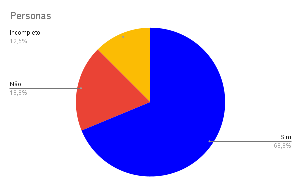

# Personas
## Introdução

Segundo a norma internacional ISO/IEC/IEEE 12207:2017(E) (ISO/IEC/IEEE, 2017, p. 82) [1], o objetivo da verificação se define em "prover evidência objetiva que o sistema ou elemento do sistema atende completamente seus requisitos e características especificados". Com isso, afim de garantir qualidade e consistência dos requisitos, realizaremos a verificação dos documentos do nosso grupo, [Caesb](https://requisitos-de-software.github.io/2023.1-Caesb/)[2], da disciplina Requisitos de Software.

## Objetivos
O objetivo deste documento é realizar a verificação das Personas, artefato da Entrega 2, do Grupo 4, [Caesb](https://requisitos-de-software.github.io/2023.1-Caesb/). De forma impessoal, este documento não deseja avaliar os membros do grupo, mas o artefato em si.

## Metodologia
Como método de investigação e produção da verificação, utilizaremos a inspeção, mais especificamente a _Fagan Inspection_. Na qual, segundo Bush [3], consiste na "inspeção de documentos entendidos como prontos para uso e busca por defeitos". Seguindo as etapas de planejamento, visão geral, preparação, inspecção e correção. Maiores detalhes de planejamento, estão apresentados no [Planejamento da Entrega 2](./0planejamento.md).

## Verificações anteriores
Uma das atividades da disciplina de Requisitos, ministrada pelo professor André Barros, é realizar a verificação do projeto de outro grupo. A nossa verificação foi feita sobre as Personas do grupo 5 ([SimpleNote]()). E o grupo 3 ([VLC](https://requisitos-de-software.github.io/2023.1-VLC/#/verificacao/entrega_2/personas)), fez a inspeção do nosso projeto (Caesb).

Dessa forma, reavaliamos nosso checklist, levando em conta os pontos levantados pelo grupo 3, mas principalmente baseando-se nas literaturas de referência. Assim, um novo checklist foi criado para a avaliação do nossas próprias Personas.

## Checklist
<!-- LIVRO BASE PARA CRIAÇÃO DAS PERGUNTAS -->
Os checklists foram estabelecido com base nos critérios da PERSONAS[⁴](#referencia-bibliografica). Seguindo as perguntas padrões estabelecidas pelo grupo no [Planejamento Geral](../0planejamento-geral.md), está apresentado na Tabela 1, o checklist do artefato Personas.As perguntas de 1 a 4 são baseadas nos padrões acordados pelo grupo, enquanto as demais questões, de 5 a 16, foram geradas a partir da inspeção e da literatura de referência.

<!-- ADICIONAR O CHECKLIST -->

| ID | Descrição | Avaliação | Observação |
| --- | --- | --- | --- |
| 1 | O artefato possui uma introdução condizente com o conteúdo do texto? | Sim | - |
| 2 | Todas as bibliografias/referências bibliográficas são utilizadas de forma correta? | Sim | - |
| 3 | Todas as tabelas e figuras são chamadas no texto, possuem legendas e fontes? | Sim | - |
| 4 | A metodologia esta de acordo com o artefato analisado? | Sim | - |
| 5 | Há no artefato uma descrição da motivação para a utilização de personas[¹](#legenda)? | Não | - |
| 6 | Há no artefato uma descrição da metodologia para a criação das personas? | Sim | - |
| 7 | Há no artefato uma descrição de como as personas devem ser utilizadas ao longo do projeto? | Não | - |
| 8 | Há no artefato uma descrição acerca da quantidade de personas criadas? | Sim | Não há uma justificativa para o número de personas |
| 9 | Há no artefato a participação de outro(s) participante(s) do projeto para a aprovação das personas criadas? | Não | - |
| 10 | Cada persona foi representada de forma realista? | Sim | - |
| 11 | Cada persona possui um nome condizente com o contexto? | Sim | - |
| 12 | Cada persona possui tarefas e objetivos em relação ao sistema? | Sim | - |
| 13 | Cada persona possui uma descrição com a sua familiaridade com tecnologia? | Incompleto | - |
| 14 | Cada persona possui uma descrição com a sua familiaridade com o sistema apresentado? | Incompleto | - |
| 15 | Há pelo menos uma persona que está bastante familiarizada com o uso do sistema? | Sim | - |
| 16 | Há pelo menos uma persona que não faz uso do sistema? | Sim | - |

Tabela 1 - Checklist Exemplo (Fonte: Autores)

[¹]() Persona: Usuário fictício criado a partir do [perfil de usuário](https://requisitos-de-software.github.io/2023.1-Caesb/Elicitacao/perfil_usuario/) para representar um usuário real.

## Gráfico
Com base no checklist feito no processo de inspeção das Personas, foi produzido o gráfico de avaliação do artefato, que pode ser visualizado/analisado na Figura 1.

</img>

Figura 1 - Resultado Visual Checklist Personas (Fonte: Autores)

## Correção
O planejamento e a situação da correção do artefatos, Personas, será registrado na Tabela 2. A data se refere ao período previsto para correção e revisão.

| ID | Descrição | Detalhes | Corretor | Revisor | Data | Status |
| --- | --- | --- | --- | --- | --- | --- |
| 1 | Motivação | Adicionar texto que explica a motivação da utilização de personas | [Pedro](https://github.com/pedrobarbosaocb) | [Daniel](https://github.com/daniel-de-sousa) | 23/06/2023 a 25/06/2023 | - |
| 2 | Utilizando Personas | Adicionar um breve texto que indica como as personas devem ser utilizadas | [Pedro](https://github.com/pedrobarbosaocb) | [Daniel](https://github.com/daniel-de-sousa) | 23/06/2023 a 25/06/2023 | - |
| 3 | Justificando Personas | Adicionar um breve texto que justifica a quantidade de personas criadas | [Pedro](https://github.com/pedrobarbosaocb) | [Daniel](https://github.com/daniel-de-sousa) | 23/06/2023 a 25/06/2023 | - |
| 4 | Validação | Adicionar um vídeo com a participação de um outro desenvolvedor para aprovação ou não das personas | [Pedro](https://github.com/pedrobarbosaocb) | [Daniel](https://github.com/daniel-de-sousa) | 24/06/2023 a 26/06/2023 | - |
| 5 | Familiaridade  | Adicionar o detalhamento acerca da familiaridade de cada persona com tecnologia e com o aplicativo | [Pedro](https://github.com/pedrobarbosaocb) | [Daniel](https://github.com/daniel-de-sousa) | 23/06/2023 a 25/06/2023 | - |

Tabela 2 - Distribuição da Correção dos Artefatos (Fonte: Autores)

### Atualização
A seguir estão listadas todas as atualizações do artefato analisado por este documento, a partir da data de sua data de entrega.

- Não há atualizações até o momento.

## Referência bibliográfica

> [1] ISO/IEC/IEEE 12207:2017(E) (ISO/IEC/IEEE, 2017, p. 82). Disponível em: https://www.iso.org/obp/ui/#iso:std:iso-iec-ieee:24765:ed-2:v1:en . Acesso em: 13 jun. 2023

> [2] CAESB, grupo 4. Disponível em https://requisitos-de-software.github.io/2023.1-Caesb/ . Acesso em: 16 jun. 2023.

> [3] BUSH, Marilyn, Chris Gerrard, Clifford Shelley. Fagan Inspection: The Silver Bullet No-one Wants to Fire. London SPIN, 25 mar. 2010.

> [4] PERSONAS. Usability.gov - Improving the User Experience . Disponível em: https://www.usability.gov/how-to-and-tools/methods/personas.html. Acesso em: 27, jun de 2023.

## Bibliografia
> MACIEL, Geovanna. Planejamento da Verificação da Etapa 1 do Grupo 2. Repositório do Grupo Bilheteria Digital da disciplina de Requisitos da Universidade de Brasília, 2023. Disponível em: <https://requisitos-de-software.github.io/2023.1-VLC/#/verificacao/entrega_2/planejamento_verificacao_etapa2>. Acesso em: 16 de Junho de 2023.

> PENHA, Igor, Lucas Gobbi. Planejamento da Verificação da Etapa 2 do Grupo 4. Repositório do Grupo VLC da disciplina de Requisitos da Universidade de Brasília, 2023. Disponível em: <https://interacao-humano-computador.github.io/2022.2-Lichess/verificacao_validacao/pc5-planejamento/>. Acesso em: 16 de Junho de 2023.

> REINEHR, Sheila. Engenharia de requisitos. E-book. ISBN 9786556900674. Disponível em: <https://integrada.minhabiblioteca.com.br/#/books/9786556900674/>. Acesso em: 13 jun. 2023.

> Sommerville, Ian. Engenharia de software. 08. ed. São Paulo: Pearson Addison Wesley, 2007.

> SERRANO, Milene, SERRANO, Maurício. Análise de Requisitos (Aula 23). UnB Gama, Brasília, 2023. Disponível no [link](../assets/referencias/Requisitos%20-%20Aula%20023.pdf).

## Histórico de Versão
|    Data    | Data Prevista de Revisão | Versão |      Descrição       |                                 Autor                                  |               Revisor               |
| :--------: | :----------------------: | :----: | :------------------: | :--------------------------------------------------------------------: | :---------------------------------: |
| 14/06/2023 |        15/06/2023        |  1.0   | Criação do documento |  [Raquel Eucaria](https://github.com/raqueleucaria) e [Pedro](https://github.com/pedrobarbosaocb)| [Caetano](https://github.com/caeslucio) |
| 21/06/2023 |        21/06/2023        |  2.0   | Adicionando Checklist |  [Pedro](https://github.com/pedrobarbosaocb)| [Caetano](https://github.com/caeslucio) |